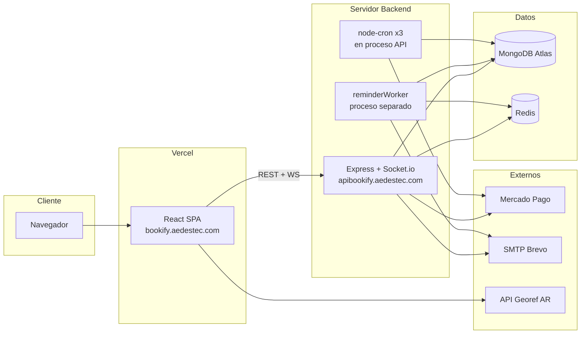
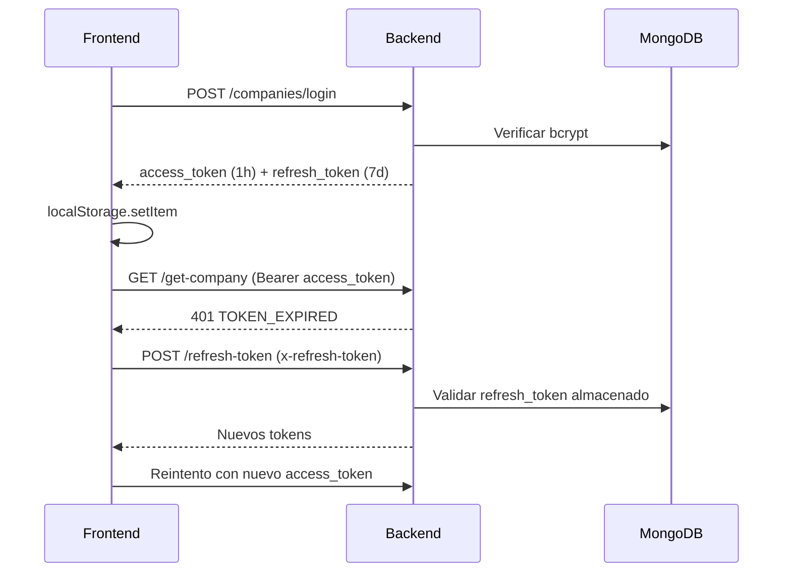
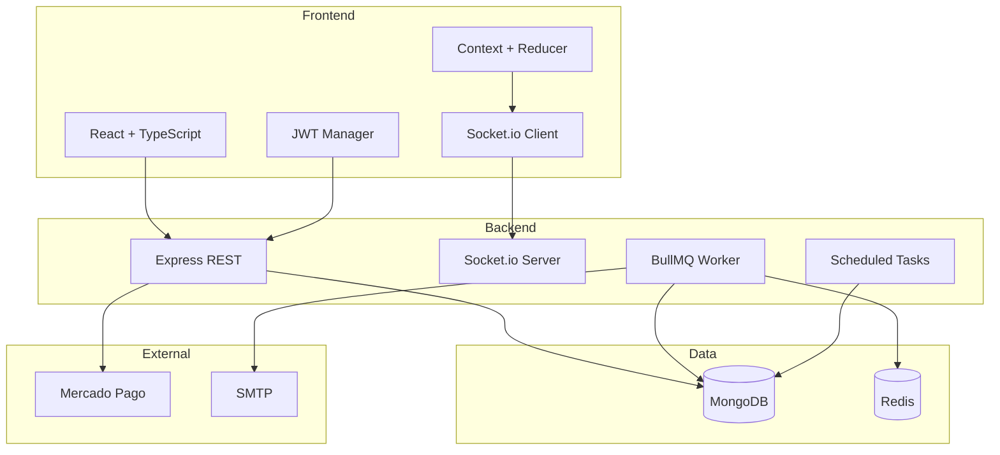

# PROJECT_ANALYSIS — Bookify

> Análisis técnico y funcional exhaustivo del proyecto Bookify.  
> Generado a partir de inspección del código fuente completo (backend + frontend).  
> Orientado a recruiters, clientes potenciales y líderes técnicos.

---

# 1. Resumen Ejecutivo

## Nombre del proyecto

**Bookify** — Plataforma SaaS de gestión y reserva de turnos.

## Objetivo principal

Permitir que **empresas de servicios** (profesionales independientes, consultorios, estudios, etc.) publiquen su disponibilidad, gestionen turnos y cobren señas de forma automatizada, mientras que **clientes finales** pueden reservar sin necesidad de registrarse en la plataforma.

## Problema de negocio que resuelve

Las pequeñas y medianas empresas de servicios enfrentan problemas recurrentes:

- **Gestión manual de agenda** mediante WhatsApp, llamadas o planillas, propensa a errores y doble reserva.
- **Ausentismo** de clientes sin mecanismos de recordatorio ni señas que comprometan la asistencia.
- **Cobro de señas** sin integración con medios de pago digitales locales (Mercado Pago en Argentina).
- **Falta de visibilidad** sobre historial, estadísticas y estado de turnos pasados.
- **Ausencia de herramientas SaaS accesibles** para profesionales que no pueden pagar soluciones enterprise.

Bookify centraliza todo el ciclo de vida del turno — desde la publicación de disponibilidad hasta el cobro, recordatorio, cancelación y reembolso — en una única plataforma web con modelo de suscripción mensual.

## Tipo de usuarios

| Rol | Descripción | Autenticación |
|-----|-------------|---------------|
| **Empresa / Profesional** | Dueño del negocio. Gestiona servicios, disponibilidad, turnos, pagos y suscripción. | JWT (access + refresh token) |
| **Cliente final** | Usuario que reserva un turno en el portal público de una empresa (`/c/:company_id`). | Sin registro; solo datos de contacto al reservar |
| **Administrador de plataforma** | Rol `admin` definido en el modelo `Company`, aunque sin panel dedicado visible en el frontend actual. | JWT |

## Principales funcionalidades

1. Registro y login de empresas con suscripción SaaS vía Mercado Pago.
2. Portal público de reserva por empresa (`/c/:company_id`).
3. CRUD de servicios con modalidades (presencial, online, a domicilio).
4. Generación y gestión de slots de disponibilidad con capacidad configurable.
5. Reserva de turnos con validación de anticipación mínima.
6. Cobro de señas integrado con Mercado Pago OAuth por empresa.
7. Reserva temporal de 15 minutos durante el proceso de pago (anti race-condition).
8. Reembolsos automáticos (50% cliente / 100% empresa / 100% si slot ocupado).
9. Panel administrativo en tiempo real (Socket.io).
10. Historial de turnos con filtros, búsqueda y estadísticas.
11. Recordatorios por email configurables (BullMQ + Redis).
12. Emails transaccionales (confirmación, cancelación, reembolso).
13. Gestión de planes (Individual, Individual Plus, Equipo) con upgrade/downgrade.
14. Vinculación OAuth de cuenta Mercado Pago por empresa.
15. Cancelación pública de turnos vía link en email.

---

# 2. Arquitectura General

## Arquitectura utilizada

**Arquitectura de tres capas desacoplada (SPA + API REST + Workers):**

```
┌─────────────────────────────────────────────────────────────────┐
│                        CLIENTE (Browser)                        │
│  React SPA (Vite) ── REST/JSON ──► Express API                  │
│                 └── WebSocket ──► Socket.io                     │
└─────────────────────────────────────────────────────────────────┘
                              │
          ┌───────────────────┼───────────────────┐
          ▼                   ▼                   ▼
    ┌──────────┐        ┌──────────┐        ┌──────────┐
    │ MongoDB  │        │  Redis   │        │Mercado   │
    │ Atlas    │        │ (BullMQ) │        │Pago API  │
    └──────────┘        └────┬─────┘        └──────────┘
                             │
                        ┌────▼─────┐
                        │ Worker   │
                        │(reminder)│
                        └────┬─────┘
                             ▼
                        ┌──────────┐
                        │ SMTP     │
                        │ (Brevo)  │
                        └──────────┘
```

El backend sigue un patrón **MVC adaptado**: Routes → Middlewares → Controllers → Models/Services/Utils. El frontend usa **Context API + useReducer** como capa de estado global, con hooks personalizados para la capa de red.

## Tecnologías empleadas

### Stack completo

| Capa | Tecnología | Versión |
|------|-----------|---------|
| Runtime backend | Node.js | — |
| Framework API | Express | ^4.22.1 |
| Lenguaje | TypeScript | ^5.5.x (strict en backend) |
| ODM | Mongoose | ^8.9.5 |
| Base de datos | MongoDB Atlas | — |
| Colas | BullMQ + ioredis | ^5.58.7 / ^5.8.0 |
| Tiempo real | Socket.io | ^4.8.1 |
| Auth | JWT + bcrypt | ^9.0.2 / ^6.0.0 |
| Pagos | Mercado Pago SDK + REST | ^2.3.0 |
| Emails | Nodemailer (SMTP Brevo) | ^7.0.11 |
| Cron | node-cron | ^3.0.3 |
| Fechas | moment + moment-timezone | TZ: America/Argentina/Buenos_Aires |
| Frontend | React | ^18.3.1 |
| Build frontend | Vite | ^7.2.7 |
| Routing | React Router DOM | ^6.30.3 |
| UI | CSS propio + Ant Design + FullCalendar | — |

## Frontend

- **Repositorio:** `bookify-frontend/`
- **Entry:** `src/main.tsx` → `src/App.tsx`
- **Build:** Vite con plugin React SWC
- **Despliegue:** Vercel (SPA con rewrites a `index.html`)
- **URL producción:** `https://bookify.aedestec.com`
- **108 archivos** en `src/` (49 `.tsx`, 43 `.css`, utilidades y tipos)

Estructura por dominio funcional:

```
src/
├── components/          # Pantallas y UI por feature
│   ├── Home/            # Landing
│   ├── LoginRegisterForms/
│   ├── UserCompanyPanels/
│   │   ├── UserPanel/   # Portal cliente
│   │   └── CompanyPanel/ # Panel empresa
│   ├── CheckoutConfirmAppointment/
│   ├── CancelAppointment/
│   └── ...
├── contexts/            # CompanyContext, UserContext
├── hooks/               # useAuthenticatedFetch, useDataForm...
├── utils/               # tokenManager, alerts, plans...
└── socket.ts            # Cliente Socket.io singleton
```

## Backend

- **Repositorio:** `bookify-backend/`
- **Entry:** `src/index.ts` (Express + HTTP server + Socket.io + crons)
- **Build:** TypeScript → `./build/` (CommonJS, target ES2016)
- **URL producción:** `https://apibookify.aedestec.com`
- **39 archivos** TypeScript en `src/`

Estructura:

```
src/
├── controllers/     # 5 controladores (lógica de negocio)
├── routes/          # 5 routers (30 endpoints)
├── models/          # 3 esquemas Mongoose
├── middlewares/     # Auth JWT + validación
├── services/        # emailService, mercadopagoService
├── queues/          # BullMQ reminder queue
├── workers/         # reminderWorker (proceso separado)
└── utils/           # Generación slots, crons, migraciones, emails HTML
```

## Base de datos

**MongoDB** con 3 colecciones principales (modelos Mongoose):

| Colección | Documentos | Relaciones |
|-----------|-----------|------------|
| `companies` | Empresas registradas | → `services[]`, → `scheduledAppointments[]` |
| `services` | Servicios ofrecidos | → `companyId`, slots embebidos |
| `appointments` | Turnos confirmados | → `companyId`, → `serviceId` |

**Redis** se utiliza exclusivamente como backend de BullMQ para la cola de recordatorios (`reminders`).

No hay migraciones formales de esquema; existen scripts one-off en `utils/migrate*.ts`.

## Servicios externos

| Servicio | Uso |
|----------|-----|
| **Mercado Pago** | Suscripciones SaaS (PreApproval), OAuth Connect, pagos de señas, webhooks, reembolsos |
| **MongoDB Atlas** | Persistencia principal |
| **Redis** | Cola de jobs BullMQ |
| **Brevo (SMTP)** | Envío de emails transaccionales vía Nodemailer |
| **API Georef Argentina** | Provincias y municipios en registro de empresa |
| **Vercel** | Hosting del frontend SPA |

## Infraestructura y despliegue



**Procesos en producción:**

1. **API principal** (`npm start`) — Express + Socket.io + 3 cron jobs.
2. **Worker de recordatorios** (`npm run worker`) — Proceso BullMQ independiente.
3. **Frontend estático** — Build Vite desplegado en Vercel.

**Variables de entorno clave:**

| Variable | Componente |
|----------|-----------|
| `MONGODB_URL_CONNECTION` | Backend + Worker |
| `SECRET_JWT_KEY` | Backend |
| `FRONTEND_URL` | CORS + Socket.io |
| `REDIS_HOST`, `REDIS_PORT` | BullMQ |
| `CLIENT_ID_MP`, `CLIENT_SECRET_MP`, `REDIRECT_URL_MP` | OAuth MP empresas |
| `ACCESS_TOKEN_MP_AEDES` | Suscripciones SaaS |
| `NODEMAILER_*` | SMTP |
| `VITE_BACKEND_URL`, `VITE_PUBLIC_KEY_MP` | Frontend |

---

# 3. Características Funcionales

## 3.1 Registro de empresa con suscripción SaaS

**Descripción:** Una empresa se registra eligiendo un plan (Individual $12.000, Individual Plus $18.000, Equipo $35.000 ARS/mes), se crea en MongoDB y se genera una suscripción Mercado Pago PreApproval en estado `pending`. Tras el pago, un webhook activa el plan.

**Flujo de uso:**
1. Usuario accede a `/register/company`.
2. Completa datos (nombre, email, contraseña, teléfono, ubicación, plan).
3. Backend crea empresa + PreApproval MP → devuelve `init_point`.
4. Redirect a Mercado Pago para pagar suscripción.
5. Webhook confirma → `status_suscription: active` + email de bienvenida.
6. Empresa accede al panel con tokens JWT.

**Tipo de usuario:** Empresa (nuevo registro).

**Archivos principales:**
- `bookify-frontend/src/components/LoginRegisterForms/FormRegister/FormRegister.tsx`
- `bookify-backend/src/controllers/companyController.ts` (`createCompany`)
- `bookify-backend/src/controllers/mercadopagoController.ts` (`manageWebhooks`)
- `bookify-backend/src/utils/planRules.ts`

---

## 3.2 Login y gestión de sesión

**Descripción:** Autenticación JWT con access token (1 hora) y refresh token (7 días) almacenado en DB y localStorage. Renovación automática transparente en el frontend.

**Flujo de uso:**
1. Empresa accede a `/login/company`.
2. POST `/companies/login` → tokens.
3. Tokens guardados en `localStorage`.
4. Requests autenticadas con `Authorization: Bearer`.
5. Si 401 + `TOKEN_EXPIRED` → refresh automático → reintento.

**Tipo de usuario:** Empresa.

**Archivos principales:**
- `bookify-frontend/src/components/LoginRegisterForms/FormLogin/FormLogin.tsx`
- `bookify-frontend/src/hooks/useAuthenticatedFetch.ts`
- `bookify-frontend/src/utils/tokenManager.ts`
- `bookify-backend/src/middlewares/verifyTokens.ts`
- `bookify-backend/src/utils/verifyData.ts` (`createTokens`)

---

## 3.3 Portal público de reserva (`/c/:company_id`)

**Descripción:** Cada empresa tiene una URL pública única donde clientes ven servicios activos y pueden reservar sin crear cuenta.

**Flujo de uso:**
1. Cliente accede a `/c/nombre-empresa`.
2. `UserContext` carga datos públicos vía `GET /companies/company/:company_id`.
3. Ve grid de servicios (`ResultsPanel`).
4. Selecciona servicio → elige día y slot → completa formulario (nombre, DNI, email, teléfono).
5. Si `signPrice > 0` → checkout Mercado Pago; si no → confirmación directa.

**Tipo de usuario:** Cliente final (sin autenticación).

**Archivos principales:**
- `bookify-frontend/src/components/UserCompanyPanels/UserPanel/`
- `bookify-frontend/src/contexts/UserContext.tsx`
- `bookify-backend/src/controllers/companyController.ts` (`getCompanyToUser`)

---

## 3.4 Gestión de servicios (CRUD)

**Descripción:** La empresa crea servicios con título, descripción, duración, precio, seña, modalidad y capacidad por turno. El plan Individual limita a 5 servicios activos.

**Flujo de uso:**
1. En panel → vista "Servicios".
2. Crear servicio vía modal (`ModalForm`).
3. POST `/services/create-service`.
4. Editar/eliminar con verificación de propiedad (`verifyService` middleware).
5. Al eliminar, se cancelan turnos agendados del servicio.

**Tipo de usuario:** Empresa.

**Archivos principales:**
- `bookify-frontend/src/components/UserCompanyPanels/CompanyPanel/CompanyInterface/ServicesPanel/`
- `bookify-backend/src/controllers/serviceController.ts`
- `bookify-backend/src/middlewares/verifyServices.ts`
- `bookify-backend/src/models/Service.ts`

---

## 3.5 Gestión de disponibilidad (slots)

**Descripción:** La empresa habilita franjas horarias en días específicos. El sistema genera slots automáticamente según hora inicio, hora fin e intervalo. Cada slot tiene `capacity` y `taken` para soportar múltiples reservas simultáneas.

**Flujo de uso:**
1. Empresa selecciona servicio → vista Calendario o modal de disponibilidad.
2. Define días (DayPicker), hora inicio/fin, intervalo y capacidad.
3. POST `/services/enable-appointments/:id` → genera array de slots.
4. Puede agregar capacidad a slot existente o eliminar slots individuales.
5. Slots vencidos se limpian automáticamente a medianoche (cron).

**Tipo de usuario:** Empresa.

**Archivos principales:**
- `bookify-frontend/src/components/.../CalendarServicePanel/`
- `bookify-frontend/src/components/.../ModalDisponibility/`
- `bookify-backend/src/utils/generateAppointments.ts`
- `bookify-backend/src/controllers/serviceController.ts` (`enabledAppointments`, `addEnableAppointment`, `deleteEnabledAppointment`)
- `bookify-backend/src/utils/cleanupAppointments.ts`

---

## 3.6 Reserva de turno (sin seña)

**Descripción:** Cliente confirma turno directamente cuando el servicio no requiere seña (`signPrice = 0`).

**Flujo de uso:**
1. Cliente selecciona slot y completa datos.
2. POST `/appointments/check-booking-hour` valida anticipación mínima.
3. POST `/appointments/add-appointment` con `verifyDataUser`.
4. Backend crea `Appointment`, actualiza `taken`/`capacity` del slot.
5. Emails de confirmación a cliente y empresa.
6. Programa recordatorios BullMQ.
7. Emite `company:appointment-added` vía Socket.io.

**Tipo de usuario:** Cliente final.

**Archivos principales:**
- `bookify-frontend/src/components/.../ServiceToSchedulePanel/`
- `bookify-backend/src/controllers/appointmentController.ts` (`confirmAppointment`, `createAppointment`)
- `bookify-backend/src/middlewares/verifyDataUser.ts`

---

## 3.7 Reserva con seña (Mercado Pago)

**Descripción:** Flujo de pago con reserva temporal anti-concurrencia. El slot se bloquea 15 minutos mientras el cliente completa el pago en Mercado Pago.

**Flujo de uso:**
1. Cliente en checkout → POST `/mercadopago/create-preference/:empresaId`.
2. Backend marca slot como `pendingAppointment` (TTL 15 min).
3. Crea preferencia MP con `external_reference` codificada.
4. Redirect a `init_point` de Mercado Pago.
5. Webhook `payment.created` → verifica pago → confirma turno o reembolsa si slot ocupado.
6. Cliente redirigido a `/processingpayment`.

**Tipo de usuario:** Cliente final + Empresa (OAuth MP vinculado).

**Archivos principales:**
- `bookify-frontend/src/components/CheckoutConfirmAppointment/`
- `bookify-frontend/src/components/ProcessingPayment/`
- `bookify-backend/src/controllers/mercadopagoController.ts` (`createPreference`)
- `bookify-backend/src/controllers/appointmentController.ts` (`confirmAppointmentWebhook`)
- `bookify-backend/src/utils/managePendingAppointments.ts`

---

## 3.8 Vinculación OAuth Mercado Pago (empresa)

**Descripción:** Cada empresa vincula su propia cuenta de Mercado Pago para recibir señas de clientes.

**Flujo de uso:**
1. En Settings → Pagos → "Vincular Mercado Pago".
2. GET `/mercadopago/oauth/generate-url/:empresaId` → URL de autorización.
3. Redirect a MP → callback `/mercadopago/oauth/callback`.
4. Backend guarda `mp_access_token`, `mp_refresh_token`, `mp_user_id`.
5. Redirect a `/panel/mercadopago-success`.
6. Cron diario renueva tokens 7 días antes de expiración.

**Tipo de usuario:** Empresa.

**Archivos principales:**
- `bookify-frontend/src/components/.../PaymentMethodsSettings/`
- `bookify-backend/src/controllers/mercadopagoController.ts`
- `bookify-backend/src/utils/refreshMercadoPagoTokens.ts`

---

## 3.9 Panel de turnos agendados (tiempo real)

**Descripción:** Vista de próximos turnos con filtros por día/semana/mes. Actualización en tiempo real vía Socket.io cuando un cliente reserva o cancela.

**Flujo de uso:**
1. Empresa accede a `/company-panel` → vista "Próximos turnos".
2. `CompanyContext` carga datos + conecta Socket.io.
3. Socket emite `joinCompany` con ID de empresa.
4. Escucha eventos: `appointment-added`, `appointment-deleted`, `service-updated`.
5. Reducer actualiza estado + toast de notificación.

**Tipo de usuario:** Empresa.

**Archivos principales:**
- `bookify-frontend/src/contexts/CompanyContext.tsx`
- `bookify-frontend/src/socket.ts`
- `bookify-frontend/src/components/.../ScheduledAppointmentsPanel/`
- `bookify-backend/src/index.ts` (Socket.io server)

---

## 3.10 Historial y estadísticas de turnos

**Descripción:** Panel con historial paginado, filtros por fecha/servicio/búsqueda de texto, y estadísticas agregadas (total, finalizados, cancelados, no asistió, pendiente de acción).

**Flujo de uso:**
1. Vista "Historial" en panel empresa.
2. GET `/appointments/company-history/:companyId` con query params.
3. Filtros con Ant Design (DatePicker, Select, Input).
4. Cambio de estado: `finished` o `did_not_attend`.

**Tipo de usuario:** Empresa.

**Archivos principales:**
- `bookify-frontend/src/components/.../HistoryPanel/`
- `bookify-backend/src/controllers/appointmentController.ts` (`getCompanyHistory`, `changeAppointmentStatus`)

---

## 3.11 Cancelación de turnos

**Descripción:** Dos vías de cancelación con políticas de reembolso diferenciadas.

**Flujo — Cancelación por cliente:**
1. Cliente accede a link `/cancel/:appointmentId` (desde email).
2. DELETE `/appointments/cancel-appointment/:id` con datos de usuario.
3. Valida anticipación mínima de cancelación.
4. Reembolso 50% de seña si hubo pago.
5. Libera slot, emails a ambas partes.

**Flujo — Cancelación por empresa:**
1. Desde `AppointmentCard` en panel.
2. DELETE `/appointments/delete-appointment/:id`.
3. Reembolso 100% de seña.
4. Emite evento Socket.io.

**Tipo de usuario:** Cliente final / Empresa.

**Archivos principales:**
- `bookify-frontend/src/components/CancelAppointment/`
- `bookify-frontend/src/components/Cards/AppointmentCard/`
- `bookify-backend/src/controllers/appointmentController.ts` (`cancelAppointment`, `deleteAppointment`)

---

## 3.12 Recordatorios por email

**Descripción:** La empresa configura recordatorios por servicio (ej: 24h antes, 1h antes). Al confirmar un turno, se programan jobs BullMQ con delay calculado.

**Flujo de uso:**
1. Settings → Recordatorios → agregar regla (horas antes + servicios).
2. PUT `/companies/update-company` con array `reminders`.
3. Al crear turno → `scheduleRemindersForAppointment` encola jobs.
4. Worker procesa job → envía email con link de cancelación.

**Tipo de usuario:** Empresa (configuración) / Cliente final (recepción).

**Archivos principales:**
- `bookify-frontend/src/components/.../RemindersSettings/`
- `bookify-backend/src/utils/scheduleRemindersForAppointment.ts`
- `bookify-backend/src/workers/reminderWorker.ts`
- `bookify-backend/src/queues/reminderQueue.ts`

---

## 3.13 Configuración de anticipaciones

**Descripción:** Reglas de negocio configurables por empresa: horas mínimas de anticipación para reservar, para cancelar, y días de visibilidad de slots.

**Flujo de uso:**
1. Settings → Anticipaciones.
2. Edita `bookingAnticipationHours`, `cancellationAnticipationHours`, `slotsVisibilityDays`.
3. PUT `/companies/update-company`.
4. Backend valida en `checkOrderTime` y cancelaciones.

**Tipo de usuario:** Empresa.

**Archivos principales:**
- `bookify-frontend/src/components/.../AnticipationsSettings/`
- `bookify-backend/src/controllers/appointmentController.ts` (`checkOrderTime`)

---

## 3.14 Gestión de planes y suscripción

**Descripción:** Upgrade, downgrade y cancelación de plan SaaS con integración Mercado Pago PreApproval.

**Flujo de upgrade:**
1. Modal de planes → selecciona plan superior.
2. POST `/suscriptions/upgrade/:suscriptionId`.
3. Cancela suscripción actual, crea nueva PreApproval → redirect MP.
4. Webhook activa nuevo plan.

**Flujo de downgrade:**
1. POST `/suscriptions/downgrade/:suscriptionId`.
2. Actualiza monto en PreApproval existente.
3. Desactiva servicios que excedan límite del nuevo plan.

**Tipo de usuario:** Empresa.

**Archivos principales:**
- `bookify-frontend/src/components/.../PlansSettings/`, `ModalPlans.tsx`
- `bookify-backend/src/controllers/suscriptionController.ts`
- `bookify-frontend/src/utils/plans.ts`

---

## 3.15 Finalización y seguimiento de turnos

**Descripción:** Post-turno, la empresa marca turnos como finalizados o "no asistió". Turnos pasados sin acción pasan automáticamente a `pending_action` (cron medianoche).

**Flujo de uso:**
1. Turno pasa su fecha → cron lo marca `pending_action`.
2. Empresa en historial o panel → cambia estado.
3. PUT `/appointments/finish-appointment/:id` o `/appointments/change-status`.

**Tipo de usuario:** Empresa.

**Archivos principales:**
- `bookify-backend/src/utils/cleanupAppointments.ts`
- `bookify-backend/src/controllers/appointmentController.ts`

---

## 3.16 Emails transaccionales

**Descripción:** Sistema completo de notificaciones HTML/texto para cada evento del ciclo de vida del turno.

| Evento | Destinatarios |
|--------|--------------|
| Confirmación | Cliente + Empresa |
| Cancelación por cliente | Cliente + Empresa |
| Cancelación por empresa | Cliente + Empresa |
| Reembolso por slot ocupado | Cliente |
| Recordatorio | Cliente |
| Cambio de plan / suscripción | Empresa |

**Archivos principales:**
- `bookify-backend/src/utils/emailTextsAndHtmls.ts`
- `bookify-backend/src/services/emailService.ts`

---

# 4. Características Técnicas

## APIs implementadas

REST API JSON sobre Express con 5 routers y 30 endpoints.

### Mapa completo de endpoints

#### `/appointments` (8 endpoints)

| Método | Ruta | Auth | Descripción |
|--------|------|------|-------------|
| GET | `/get-appointment/:id` | Público | Detalle de turno |
| POST | `/add-appointment` | `verifyDataUser` | Confirmar turno sin pago |
| PUT | `/finish-appointment/:id` | JWT empresa | Marcar como finalizado |
| DELETE | `/cancel-appointment/:id` | `verifyDataUser` | Cancelación por cliente |
| DELETE | `/delete-appointment/:id` | JWT empresa | Cancelación por empresa |
| GET | `/company-history/:companyId` | JWT empresa | Historial paginado + stats |
| POST | `/check-booking-hour` | Público | Validar anticipación de reserva |
| PUT | `/change-status` | JWT empresa | Cambiar a finished/did_not_attend |

#### `/companies` (7 endpoints)

| Método | Ruta | Auth | Descripción |
|--------|------|------|-------------|
| POST | `/register` | Público | Registro + suscripción MP |
| POST | `/login` | Público | Login empresa |
| POST | `/logout` | JWT empresa | Invalidar refresh token |
| POST | `/refresh-token` | Refresh token | Renovar access token |
| GET | `/get-company` | JWT empresa | Perfil completo |
| PUT | `/update-company` | JWT empresa | Actualizar perfil y reglas |
| GET | `/company/:company_id` | Público | Vista pública para clientes |

#### `/services` (8 endpoints)

| Método | Ruta | Auth | Descripción |
|--------|------|------|-------------|
| POST | `/create-service` | JWT empresa | Crear servicio |
| PUT | `/edit-service/:id` | JWT + verifyService | Editar servicio |
| DELETE | `/delete-service/:id` | JWT + verifyService | Eliminar servicio |
| POST | `/enable-appointments/:id` | JWT + verifyService | Generar slots masivos |
| POST | `/add-enable-appointment/:id` | JWT + verifyService | Incrementar capacidad de slot |
| DELETE | `/delete-appointment/:id` | JWT + verifyService | Eliminar/reducir slot |
| GET | `/contains-sign-price/:id` | Público | Verificar si requiere seña |
| GET | `/:id` | Público | Detalle del servicio |

#### `/mercadopago` (4 endpoints)

| Método | Ruta | Auth | Descripción |
|--------|------|------|-------------|
| POST | `/create-preference/:empresaId` | `verifyDataUser` | Crear preferencia de pago |
| GET | `/oauth/callback` | Público | Callback OAuth MP |
| GET | `/oauth/generate-url/:empresaId` | JWT empresa | URL de autorización OAuth |
| POST | `/webhooks` | Público | Webhooks MP (pagos, suscripciones) |

#### `/suscriptions` (3 endpoints)

| Método | Ruta | Auth | Descripción |
|--------|------|------|-------------|
| POST | `/upgrade/:suscriptionId` | JWT empresa | Upgrade de plan |
| POST | `/downgrade/:suscriptionId` | JWT empresa | Downgrade de plan |
| DELETE | `/cancel/:suscriptionId` | JWT empresa | Cancelar suscripción |

## Middleware

| Middleware | Archivo | Función |
|-----------|---------|---------|
| `authenticateTokenCompany` | `verifyTokens.ts` | Valida JWT access token en header `Authorization` |
| `authenticateRefreshTokenCompany` | `verifyTokens.ts` | Valida refresh token en body/header |
| `verifyDataUser` | `verifyDataUser.ts` | Valida y parsea datos del cliente final (`req.body.dataUser`) |
| `verifyService` | `verifyServices.ts` | Verifica que el servicio pertenezca a la empresa autenticada |
| CORS | `index.ts` | Restringe origen a `FRONTEND_URL` |
| `express.json()` | `index.ts` | Parseo de body JSON |

## Validaciones

Centralizadas en `utils/verifyData.ts`:

- **Email:** regex estándar.
- **Contraseña:** mínimo 6 caracteres.
- **Empresa:** nombre, email único, `company_id` slug, teléfono, plan de suscripción.
- **Servicio:** título, duración, precio, modalidad, capacidad.
- **Usuario final:** nombre, apellido, email, DNI, teléfono, ubicación opcional.
- **Turno:** companyId, serviceId, fecha válida.

Validaciones de negocio adicionales en controllers:
- Límite de servicios por plan (`planRules.ts`).
- Anticipación mínima de reserva y cancelación.
- Disponibilidad de slot (`isAppointmentAvailable`).
- Empresa vinculada a MP para cobrar señas.

## Autenticación



- **Hash:** bcrypt con salt rounds en registro.
- **Tokens:** JWT firmados con `SECRET_JWT_KEY`.
- **Refresh token:** almacenado en `Company.refresh_token` (invalidación en logout).
- **Portal cliente:** endpoints públicos con `skipAuth: true`.

## Autorización

- **Nivel empresa:** JWT decodifica `{ id, name, email }` → `req.company`.
- **Nivel servicio:** `verifyService` verifica ownership via `company.services[]`.
- **Nivel cliente:** `verifyDataUser` valida identidad sin JWT (datos en body).
- **Rol `admin`:** definido en schema pero sin RBAC granular implementado.

## Gestión de estados

### Frontend

| Context | Patrón | Estado |
|---------|--------|--------|
| `CompanyContext` | `useReducer` + 12 acciones | Empresa, servicios, turnos, loading, error |
| `UserContext` | `useReducer` | Datos públicos de empresa para portal cliente |
| Componentes | `useState` local | Vistas activas, modales, formularios |

### Backend

Estados de turno (`Appointment.status`):

```
scheduled → finished
scheduled → cancelled (por cliente o empresa)
scheduled → did_not_attend
scheduled → pending_action (automático, cron)
```

Estados de suscripción (`Company.suscription.status_suscription`):

```
pending → active (webhook MP)
active → upgrading → active
active → downgrading → active
active → inactive (cancelación)
```

## Gestión de errores

**Backend:**
- Try/catch en cada controller con `res.status(4xx/5xx).send({ error })`.
- Rollback en registro: si falla PreApproval, elimina empresa creada.
- Reembolso automático si pago aprobado pero slot no disponible.
- Worker BullMQ: 3 reintentos por job de recordatorio.

**Frontend:**
- `useAuthenticatedFetch` centraliza manejo de errores y retry de token.
- `react-toastify` para notificaciones no bloqueantes.
- `sweetalert2` para confirmaciones destructivas.
- `CompanyContext` con estado `error` y `clearError`.

## Persistencia de datos

| Entidad | Estrategia |
|---------|-----------|
| Empresas | Documento MongoDB con subdocumentos (suscripción, reminders) |
| Servicios | Slots embebidos en array `availableAppointments` (no colección separada) |
| Turnos | Colección independiente con snapshot de precio/duración/modo |
| Tokens MP | Campos en documento Company |
| Refresh JWT | Campo `refresh_token` en Company |
| Jobs recordatorio | IDs almacenados en `Appointment.reminderJobs` |
| Reservas temporales | Subdocumentos `pendingAppointments` en Service con TTL lógico |

## Integraciones externas

### Mercado Pago (doble flujo de tokens)

1. **Token Aedes** (`ACCESS_TOKEN_MP_AEDES`): suscripciones SaaS de la plataforma.
2. **OAuth por empresa** (`mp_access_token`): cobro de señas a clientes.

Operaciones MP implementadas:
- PreApproval (crear, actualizar, cancelar suscripciones)
- Checkout Preferences (señas)
- OAuth token exchange + refresh automático
- Webhooks (pagos, suscripciones, desautorización)
- Refunds (parcial 50%, total 100%)

### Email (Nodemailer + Brevo SMTP)

Templates HTML personalizados con branding Bookify, links de cancelación y botones CTA.

### API Georef Argentina

`https://apis.datos.gob.ar/georef/api` — provincias y departamentos en formulario de registro.

## Configuración de entornos

| Entorno | Frontend | Backend |
|---------|----------|---------|
| Desarrollo | `localhost:5173` (Vite) | `localhost:PORT` (ts-node-dev) |
| Producción | `bookify.aedestec.com` (Vercel) | `apibookify.aedestec.com` |

Configuración via `.env` (backend) y `.env` con prefijo `VITE_` (frontend). No existe `.env.example` documentado en el repositorio.

---

# 5. Decisiones de Ingeniería

## Por qué se eligieron determinadas tecnologías

| Tecnología | Razón de elección |
|-----------|-------------------|
| **MongoDB** | Modelo flexible para slots embebidos, reminders y pending appointments sin joins complejos. Ideal para documentos con estructura variable por servicio. |
| **Express** | Framework minimalista, maduro, amplio ecosistema. Adecuado para API REST con webhooks y Socket.io en el mismo proceso. |
| **React + Vite** | SPA rápida de desarrollar con HMR instantáneo. Vite 7 ofrece build optimizado para despliegue en Vercel. |
| **TypeScript** | Tipado en ambos extremos reduce errores en contratos API y modelos de datos compartidos (`types.d.ts`). |
| **Socket.io** | Actualizaciones en tiempo real del panel empresa sin polling. Rooms por `companyId` para aislamiento. |
| **BullMQ + Redis** | Recordatorios programados con delay preciso, reintentos y proceso worker separado del API (no bloquea requests). |
| **Mercado Pago** | Standard de pagos en Argentina. OAuth Connect permite que cada empresa cobre en su propia cuenta. |
| **moment-timezone** | TZ fija `America/Argentina/Buenos_Aires` — crítico para negocio local con horarios estrictos. |
| **Context API + useReducer** | Suficiente para 2 contextos globales sin overhead de Redux. Reducer maneja bien eventos Socket.io. |

## Patrones utilizados

| Patrón | Implementación |
|--------|---------------|
| **MVC** | Routes → Controllers → Models en backend |
| **Repository (implícito)** | Mongoose models como capa de acceso a datos |
| **Middleware Chain** | Auth → Authorization → Handler |
| **Reducer Pattern** | `CompanyContext` con acciones tipadas |
| **Custom Hook Layer** | `useAuthenticatedFetch` como abstraction sobre fetch |
| **Singleton** | `socket.ts` — una conexión WebSocket por sesión |
| **Job Queue** | BullMQ para procesamiento asíncrono de emails |
| **Cron Jobs** | Tareas de mantenimiento en proceso principal |
| **Optimistic UI (parcial)** | Reducer actualiza estado tras eventos Socket sin refetch |
| **Snapshot Pattern** | `serviceInfo.title`, `price`, `duration` en Appointment preservan datos si se borra servicio |
| **Temporary Reservation** | `pendingAppointments` con TTL para evitar race conditions en pagos |
| **Dual Token Strategy** | Access corto + refresh largo con almacenamiento server-side |

## Organización del proyecto

- **Monorepo lógico** con dos repositorios independientes (`bookify-backend`, `bookify-frontend`).
- **Separación por dominio funcional** en frontend (`UserPanel` vs `CompanyPanel`).
- **Utils compartidos** por responsabilidad (fechas, emails, generación de slots, migraciones).
- **Proceso worker separado** para concerns de background (principio de separación de responsabilidades).

## Estrategias de escalabilidad

| Área | Estrategia actual | Potencial de mejora |
|------|------------------|---------------------|
| API | Monolito Express single-process | Horizontal scaling con sticky sessions para Socket.io |
| Colas | BullMQ con worker dedicado | Múltiples workers, priorización de jobs |
| DB | MongoDB Atlas (cloud) | Índices en `availableAppointments.datetime`, sharding si crece |
| Slots | Arrays embebidos en Service | Podría migrar a colección `slots` para queries más eficientes |
| Cache | No implementado | Redis cache para `get-company` y vistas públicas |
| CDN | Vercel edge para frontend | Ya aprovechado |

## Estrategias de mantenibilidad

- TypeScript strict en backend.
- Tipos compartidos en `types.d.ts` (ambos proyectos).
- Scripts de migración versionados (`npm run migrate:*`).
- Templates de email centralizados en un solo archivo.
- Reglas de planes centralizadas en `planRules.ts`.
- Separación controllers/routes facilita agregar endpoints sin tocar lógica.

---

# 6. Problemas Técnicos Resueltos

## 6.1 Race condition en reservas con pago

| Aspecto | Detalle |
|---------|---------|
| **Problema** | Dos clientes podían intentar reservar el mismo slot mientras uno completaba el pago en Mercado Pago. |
| **Impacto** | Doble cobro, turnos duplicados, experiencia de usuario degradada. |
| **Solución** | `pendingAppointments` con TTL de 15 minutos. Al crear preferencia MP, el slot se marca como pendiente. Cron cada 5 min limpia expirados. Webhook verifica disponibilidad antes de confirmar; si no hay slot, reembolso automático 100%. |
| **Beneficio** | Integridad de datos sin locks pesimistas. UX fluida con ventana razonable para completar pago. |

## 6.2 Gestión de capacidad por slot (no solo binario)

| Aspecto | Detalle |
|---------|---------|
| **Problema** | Servicios grupales (ej: clase de yoga, taller) necesitan múltiples reservas en el mismo horario. |
| **Impacto** | Modelo binario (ocupado/libre) no sirve para negocios con capacidad > 1. |
| **Solución** | Schema `{ datetime, capacity, taken }`. Al reservar, `$inc: taken`. Solo se elimina slot de `availableAppointments` cuando `taken >= capacity`. |
| **Beneficio** | Flexibilidad para servicios individuales y grupales con un único modelo de datos. |

## 6.3 Sincronización en tiempo real del panel empresa

| Aspecto | Detalle |
|---------|---------|
| **Problema** | Sin actualización en vivo, la empresa no ve reservas/cancelaciones hasta refrescar manualmente. |
| **Impacto** | Panel desactualizado, mala experiencia operativa. |
| **Solución** | Socket.io con rooms por `companyId`. Emisión de eventos en cada mutación (crear/cancelar turno, actualizar servicio). Frontend con reducer que aplica deltas + toasts. |
| **Beneficio** | Panel siempre actualizado. La empresa reacciona inmediatamente a nuevas reservas. |

## 6.4 Recordatorios programados con precisión

| Aspecto | Detalle |
|---------|---------|
| **Problema** | Cron cada X minutos para recordatorios es impreciso y consume recursos escaneando toda la DB. |
| **Impacto** | Emails fuera de hora o no enviados. Carga innecesaria en DB. |
| **Solución** | Migración de cron legacy a BullMQ con `delay` calculado por turno (`jobTime = appointmentDate - hoursBefore`). Worker separado con 3 reintentos. IDs de jobs guardados en `Appointment.reminderJobs`. |
| **Beneficio** | Envío exacto al minuto. Escalable. Proceso API no bloqueado. |

## 6.5 Doble flujo de tokens Mercado Pago

| Aspecto | Detalle |
|---------|---------|
| **Problema** | La plataforma cobra suscripción SaaS Y cada empresa cobra señas a sus clientes — requieren cuentas MP distintas. |
| **Impacto** | Confusión de fondos, imposibilidad de que empresas cobren directamente. |
| **Solución** | Token Aedes para PreApproval (suscripciones) + OAuth Connect per-empresa para checkout preferences (señas). Refresh automático de tokens OAuth con cron diario. |
| **Beneficio** | Modelo de negocio SaaS + marketplace de pagos correctamente separado. |

## 6.6 Reembolsos diferenciados por actor

| Aspecto | Detalle |
|---------|---------|
| **Problema** | Políticas de cancelación distintas según quién cancela (cliente vs empresa vs sistema). |
| **Impacto** | Disputas, pérdida de confianza, obligaciones legales de devolución. |
| **Solución** | Cliente cancela → 50% de seña. Empresa cancela → 100%. Sistema (slot ocupado) → 100%. Función `refund()` centralizada con idempotency key. |
| **Beneficio** | Política clara automatizada. Reduce carga operativa de la empresa. |

## 6.7 Limpieza automática de datos temporales

| Aspecto | Detalle |
|---------|---------|
| **Problema** | Slots pasados, turnos vencidos y pending expirados acumulan basura en DB. |
| **Impacto** | Queries lentas, UI muestra horarios inválidos, inconsistencia de estados. |
| **Solución** | Cron medianoche: turnos pasados → `pending_action`, limpia `availableAppointments` y `scheduledAppointments` vencidos. Cron cada 5 min: limpia `pendingAppointments` expirados. |
| **Beneficio** | DB limpia sin intervención manual. Estados de turno reflejan realidad operativa. |

## 6.8 Preservación de historial ante borrado de servicio

| Aspecto | Detalle |
|---------|---------|
| **Problema** | Si se elimina un servicio, los turnos históricos pierden contexto. |
| **Impacto** | Historial incompleto, imposible auditar. |
| **Solución** | Campo `serviceInfo: { title }` en Appointment como snapshot. Script de migración `migrateServiceInfoNull`. |
| **Beneficio** | Historial íntegro independientemente del ciclo de vida del servicio. |

## 6.9 Renovación transparente de sesión

| Aspecto | Detalle |
|---------|---------|
| **Problema** | Access token de 1 hora expira durante uso activo del panel. |
| **Impacto** | Logout inesperado, pérdida de trabajo en formularios. |
| **Solución** | `useAuthenticatedFetch` detecta `TOKEN_EXPIRED`, renueva con refresh token, reintenta request original. Solo logout si refresh también falla. |
| **Beneficio** | Sesión continua sin interrupciones perceptibles para el usuario. |

## 6.10 Zona horaria Argentina consistente

| Aspecto | Detalle |
|---------|---------|
| **Problema** | Servidor, DB y cliente pueden interpretar fechas en TZ distintas. |
| **Impacto** | Turnos mostrados en hora incorrecta, validaciones de anticipación fallidas. |
| **Solución** | `moment-timezone` con TZ fija `America/Argentina/Buenos_Aires` en todo el backend. Formateo consistente `YYYY-MM-DD HH:mm` en responses. |
| **Beneficio** | Coherencia temporal en todo el sistema para el mercado objetivo. |

---

# 7. Complejidades Técnicas Destacables

## Lógica compleja de reservas

El flujo de reserva no es un simple INSERT. Involucra:
1. Verificar disponibilidad (incluyendo pending appointments).
2. Validar anticipación mínima configurable.
3. Decrementar capacidad o eliminar slot.
4. Crear appointment con snapshot de datos.
5. Programar N recordatorios en BullMQ.
6. Enviar 2 emails.
7. Emitir evento Socket.io con payload formateado.

Todo esto ocurre tanto en confirmación directa como en webhook de pago, con lógica de reembolso como fallback.

## Manejo de fechas

- Generación de slots con intervalos configurables (`generateAppointments`).
- Parsing con TZ explícita: `moment.tz(date, 'YYYY-MM-DD HH:mm', 'America/Argentina/Buenos_Aires')`.
- Formateo bidireccional string ↔ Date para API y UI.
- Cálculo de delay para jobs: `jobTime.diff(moment())`.
- Filtros temporales en frontend (día/semana/mes) con `moment`.
- Limpieza de slots por comparación `datetime < today`.

## Concurrencia

- `pendingAppointments` como semáforo temporal durante pagos.
- `$inc` atómico en MongoDB para `taken`.
- `findOneAndUpdate` con filtro posicional para actualizar slot específico.
- BullMQ garantiza procesamiento de jobs sin duplicación.
- Socket.io rooms evitan broadcast global.

## Optimización

- `.lean()` en queries de lectura frecuente.
- `populate` selectivo (solo campos necesarios en recordatorios).
- Paginación en historial (`page`, `limit`).
- Worker separado del API (no bloquea event loop).
- `removeOnComplete: true` en jobs BullMQ (no acumula jobs completados).

## Seguridad

- Contraseñas hasheadas con bcrypt.
- JWT con expiración corta + refresh rotable.
- Middleware de ownership en servicios.
- CORS restringido a frontend conocido.
- Validación de inputs en middleware dedicado.
- **Áreas de mejora detectadas:** webhooks MP sin verificación de firma, no hay rate limiting, servidor escucha en `localhost` (no `0.0.0.0`), `.env` con secretos en repositorio.

## Diseño de base de datos

- **Embedded vs Referenced:** slots embebidos en Service (lectura rápida), appointments referenciados (queries independientes).
- **Denormalización intencional:** `serviceInfo`, `price`, `duration`, `mode` en Appointment.
- **Índices implícitos:** `company_id` unique, `email` unique en Company.
- **Subdocumentos:** `suscription`, `reminders`, `availableAppointments`, `pendingAppointments`.

## Integraciones

- **Mercado Pago:** 6 operaciones distintas (OAuth, Preferences, Payments, Refunds, PreApproval, Webhooks).
- **External reference encoding:** string compuesta con 9 campos para reconstruir turno en webhook.
- **Idempotency key** en reembolsos (`generateRandomId`).

## Despliegue

- Frontend: Vercel con SPA fallback (`vercel.json`).
- Backend: proceso Node compilado + worker separado + Redis + MongoDB Atlas.
- URLs de producción hardcodeadas en emails y redirects MP.

## Sincronización frontend/backend

- Contrato de datos: fechas como strings `YYYY-MM-DD HH:mm` en API, parseadas en UI.
- Eventos Socket.io tipados en `types/socket.ts`.
- Reducer sincronizado con mutaciones del backend (misma estructura de Service/Appointment).
- `useAuthenticatedFetch` como única capa HTTP (excepto `useFetchData` legacy para Georef).

---

# 8. Métricas del Proyecto

| Métrica | Backend | Frontend | Total |
|---------|---------|----------|-------|
| **Archivos fuente** | 39 `.ts` | 49 `.tsx` + 43 `.css` + 16 otros | ~147 en `src/` |
| **Componentes React** | — | 47 UI + 2 entry (`App`, `main`) | **49** |
| **Endpoints REST** | **30** | — | **30** |
| **Archivos de rutas** | **5** | — | **5** |
| **Rutas frontend (React Router)** | — | **9** (+ 4 vistas internas) | **9** + 4 |
| **Entidades / Modelos** | **3** (Company, Service, Appointment) | — | **3** |
| **Colecciones MongoDB** | **3** | — | **3** |
| **Pantallas principales** | — | **9** rutas + **4** vistas panel | **13** |
| **Servicios backend** | **2** (email, mercadopago) | — | **2** |
| **Módulos de integración frontend** | — | **6** (fetch, token, socket, config, notifications, alerts) | **6** |
| **Controllers** | **5** | — | **5** |
| **Middlewares** | **3** + CORS/JSON | — | **3** |
| **Context providers** | — | **2** | **2** |
| **Custom hooks** | — | **4** archivos (8 exports) | **4** |
| **Workers / Colas** | **1** worker + **1** queue | — | **2** |
| **Cron jobs activos** | **3** | — | **3** |
| **Scripts de migración** | **4** | — | **4** |
| **Dependencias producción** | **16** | **17** | **33** |
| **Templates de email** | **8+** eventos | — | **8+** |
| **Planes SaaS** | **3** | **3** | **3** |
| **Modalidades de servicio** | **3** | **3** | **3** |
| **Estados de turno** | **5** | — | **5** |
| **Eventos Socket.io** | **3** escucha + **3** emisión | **6** escucha + **1** emisión | — |

---

# 9. Mi Participación Como Desarrollador

> Esta sección describe las capacidades que el proyecto evidencia, orientada a portfolio profesional. El desarrollo está asociado a **Aedes Technologies** (dominio `aedestec.com`, emails de contacto en el código).

## Habilidades demostradas

| Habilidad | Evidencia en el proyecto |
|-----------|------------------------|
| **Desarrollo Full Stack** | Arquitectura completa desde DB hasta UI, con dos repositorios coordinados |
| **TypeScript avanzado** | Tipos compartidos, strict mode, generics en hooks y reducers |
| **Diseño de APIs REST** | 30 endpoints con auth diferenciada, paginación, filtros y stats |
| **Modelado NoSQL** | Esquemas con subdocumentos, referencias, snapshots y arrays embebidos |
| **Integración de pagos** | Mercado Pago OAuth, webhooks, suscripciones, reembolsos |
| **Sistemas en tiempo real** | Socket.io con rooms, eventos tipados y sincronización con reducer |
| **Procesamiento asíncrono** | BullMQ, workers, cron jobs, colas con reintentos |
| **Emails transaccionales** | Templates HTML responsivos para 8+ eventos de negocio |
| **UX de producto** | Portal cliente sin fricción + panel admin completo |
| **Internacionalización local** | TZ Argentina, ARS, API Georef, Mercado Pago |
| **DevOps básico** | Build pipeline, despliegue Vercel, variables de entorno, procesos separados |

## Conocimientos técnicos evidenciados

- Patrón MVC con capa de servicios y utilidades.
- Autenticación JWT dual (access + refresh) con renovación automática.
- Manejo de race conditions sin locks explícitos (reserva temporal + TTL).
- Webhooks como mecanismo de confirmación asíncrona de pagos.
- Separación de procesos (API vs Worker) para concerns de background.
- Reducer pattern para estado complejo con eventos externos (WebSocket).
- Generación algorítmica de slots con intervalos configurables.
- Políticas de negocio codificadas (planes, anticipaciones, reembolsos).
- Migraciones de datos con scripts versionados.

## Problemas de negocio resueltos

1. **Digitalización de agenda** para profesionales independientes.
2. **Reducción de ausentismo** con señas y recordatorios automáticos.
3. **Monetización SaaS** con 3 tiers de suscripción y cobro recurrente.
4. **Cobro digital local** vía Mercado Pago sin intermediación manual.
5. **Operación en tiempo real** sin necesidad de refrescar el panel.
6. **Trazabilidad completa** con historial, estados y estadísticas.

## Capacidades Full Stack demostradas



El desarrollador demuestra capacidad para:
- Diseñar un producto SaaS completo, no solo features aisladas.
- Tomar decisiones de arquitectura (embedded slots, worker separado, dual MP tokens).
- Implementar lógica de negocio compleja (capacidad, pending, reembolsos).
- Entregar UX funcional con CSS propio y componentes de librerías selectivas.
- Desplegar en producción con dominio propio (`bookify.aedestec.com`).

---

# 10. Aprendizajes y Evolución

## Conceptos avanzados aplicados

1. **Job queues con delay dinámico** — BullMQ para scheduling preciso vs cron polling.
2. **OAuth Connect multi-tenant** — cada empresa con sus propios tokens MP.
3. **Webhook-driven architecture** — confirmación de pagos asíncrona con fallback de reembolso.
4. **Capacidad como contador atómico** — `$inc` en MongoDB para concurrencia.
5. **Temporary reservation pattern** — semáforo con TTL para transacciones de pago.
6. **Real-time state synchronization** — WebSocket + Reducer como mini-ECS.
7. **Snapshot/denormalization** — preservar integridad histórica.
8. **SaaS billing** — PreApproval con upgrade/downgrade y webhook lifecycle.
9. **Timezone-aware scheduling** — crítico para productos locales.
10. **Token refresh interceptors** — capa HTTP transparente en frontend.

## Aprendizajes que deja el proyecto

- La complejidad de un sistema de turnos va mucho más allá del CRUD: capacidad, concurrencia, pagos y tiempo real se intersectan.
- Integrar Mercado Pago correctamente requiere separar flujos (plataforma vs vendedor) y manejar edge cases (pago aprobado + slot no disponible).
- Socket.io simplifica enormemente la UX del panel admin pero introduce acoplamiento (export de `io` desde `index.ts`).
- BullMQ es superior a cron para tareas programadas con delay específico por entidad.
- MongoDB es adecuado para slots embebidos pero puede complicar queries analíticas a escala.

## Mejoras para una versión futura

| Área | Mejora propuesta | Prioridad |
|------|-----------------|-----------|
| **Testing** | Unit tests (Jest/Vitest) + integration tests para flujos críticos de reserva y pago | Alta |
| **Seguridad** | Verificación de firma en webhooks MP, rate limiting, helmet, rotación de secretos | Alta |
| **Observabilidad** | Logging estructurado, APM (Sentry/Datadog), health checks | Alta |
| **CI/CD** | Pipeline automatizado con lint, test, build y deploy | Media |
| **Documentación API** | OpenAPI/Swagger para los 30 endpoints | Media |
| **Ruta `/user-panel`** | Eliminar o implementar (actualmente referenciada pero no definida) | Media |
| **Dependencias huérfanas** | Remover `@mui/material`, `cookie-parser`, `brevo` sin uso | Baja |
| **Código legacy** | Eliminar `sendAppointmentReminders.ts` (cron reemplazado por BullMQ) | Baja |
| **Checkout embebido** | Wallet Brick de MP en lugar de redirect para mejor UX | Media |
| **Multi-idioma** | i18n para expansión regional | Baja |
| **App móvil** | PWA o React Native para empresas en movimiento | Media |
| **Roles granulares** | RBAC con empleados por empresa (plan Team) | Media |
| **Analytics** | Dashboard de métricas de negocio (ingresos, tasa de ausentismo) | Media |
| **Índices MongoDB** | Índices compuestos en campos de query frecuente | Media |
| **0.0.0.0 binding** | Servidor escuchando en todas las interfaces para deploy en container | Alta |

---

# 11. Resumen Para Portfolio

## Descripción breve

**Bookify** es una plataforma SaaS full stack de gestión y reserva de turnos desarrollada para el mercado argentino. Permite a profesionales y empresas de servicios publicar su disponibilidad, cobrar señas vía Mercado Pago, enviar recordatorios automáticos y administrar su agenda en tiempo real, mientras los clientes reservan sin crear cuenta.

## Problema resuelto

Elimina la gestión manual de turnos (WhatsApp, planillas, llamadas) que genera doble reservas, ausentismo y fricción en el cobro de señas. Ofrece una solución digital accesible con modelo de suscripción mensual para profesionales independientes y equipos pequeños.

## Tecnologías utilizadas

`React` · `TypeScript` · `Vite` · `Node.js` · `Express` · `MongoDB` · `Mongoose` · `Redis` · `BullMQ` · `Socket.io` · `JWT` · `Mercado Pago` · `Nodemailer` · `Ant Design` · `FullCalendar` · `Vercel`

## Principales desafíos técnicos

- Prevención de race conditions en reservas con pago (reserva temporal + reembolso automático).
- Integración dual de Mercado Pago (suscripciones SaaS + OAuth per-empresa para señas).
- Sistema de capacidad por slot para servicios individuales y grupales.
- Recordatorios programados con precisión mediante BullMQ y worker dedicado.
- Sincronización en tiempo real del panel empresa vía WebSocket.
- Reembolsos automáticos con políticas diferenciadas por actor.
- Manejo consistente de zona horaria Argentina en todo el stack.

## Logros destacados

- **30 endpoints REST** con autenticación multi-nivel y validaciones de negocio.
- **Producto en producción** desplegado en `bookify.aedestec.com`.
- **3 planes SaaS** con cobro recurrente, upgrade y downgrade automatizados.
- **8+ flujos de email** transaccional con templates HTML profesionales.
- **Panel en tiempo real** que actualiza turnos sin recargar la página.
- **Portal cliente sin registro** que reduce fricción al mínimo.
- **Arquitectura escalable** con worker separado y colas Redis.

## Impacto generado

Bookify transforma la operación diaria de profesionales de servicios: de un proceso manual propenso a errores a un flujo digital automatizado que incluye cobro, recordatorio, cancelación y reembolso. Reduce ausentismo mediante señas, ahorra horas de gestión administrativa y genera ingresos recurrentes para la plataforma mediante suscripciones. Demuestra capacidad para diseñar, implementar y desplegar un producto SaaS completo con integraciones de pagos locales, procesamiento asíncrono y experiencia de usuario en tiempo real.

---

*Documento generado mediante análisis estático del código fuente de `bookify-backend/` y `bookify-frontend/`.*
