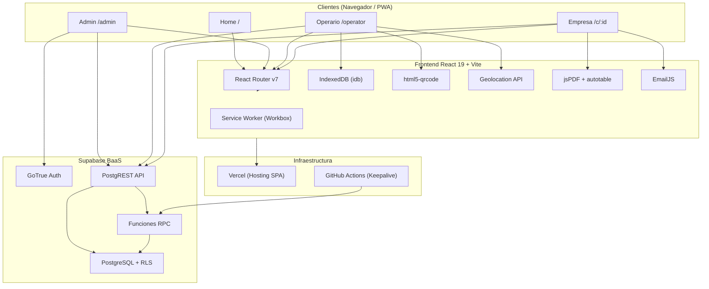
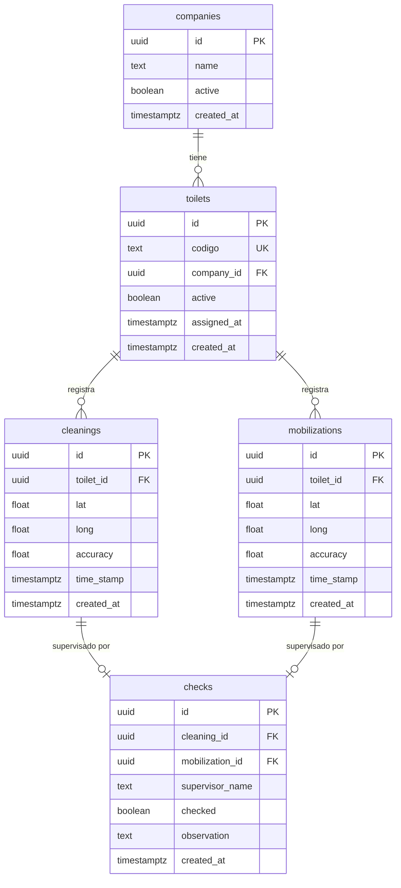
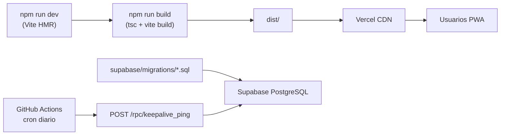
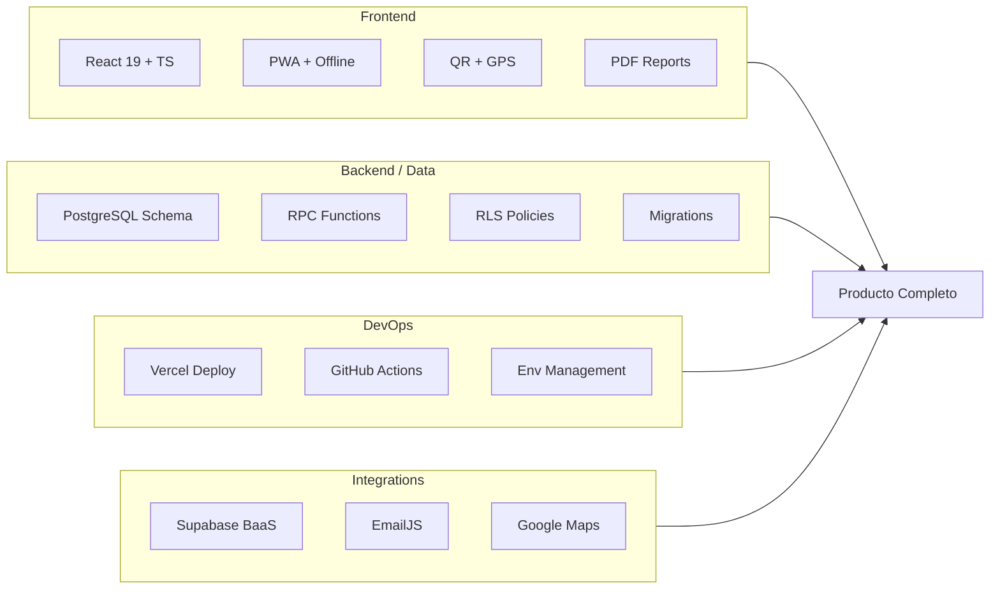

# Análisis Exhaustivo del Proyecto — Portable Toilet Manager

> **Proyecto:** Gestor de Baños Químicos — Don Fortunato  
> **Cliente operativo:** Don Fortunato Servicios y Transporte (Catriel, Río Negro, Argentina)  
> **Desarrollado por:** Aedes  
> **Fecha de análisis:** Junio 2026

---

# 1. Resumen Ejecutivo

## Nombre del proyecto

**Portable Toilet Manager** (nombre comercial: **Gestor de Baños — Don Fortunato**)

## Objetivo principal

Digitalizar y centralizar la gestión operativa de baños químicos portátiles: registrar limpiezas y movilizaciones en campo mediante escaneo QR con geolocalización, supervisar el cumplimiento del servicio desde paneles web, y generar reportes formales (PDF/CSV) para facturación y auditoría ante clientes industriales.

## Problema de negocio que resuelve

Don Fortunato presta servicios de alquiler, limpieza y movilización de baños químicos a empresas de construcción e industria (ej. Techint / OLDVALV). Antes de esta solución, el control operativo dependía de planillas manuales, llamadas telefónicas y registros en papel, lo que generaba:

- **Falta de trazabilidad** de limpiezas y traslados de unidades.
- **Imposibilidad de verificar en tiempo real** qué baños estaban limpios o pendientes.
- **Dificultad para auditar** el servicio ante el cliente (sin evidencia georreferenciada).
- **Procesos de facturación lentos** al consolidar manualmente alquileres, limpiezas y movilizaciones por mes.
- **Operación en zonas sin conectividad** donde los operarios no podían registrar eventos.

La aplicación convierte cada baño en una entidad rastreable con historial digital, evidencia GPS y flujos de supervisión formalizados.

## Tipo de usuarios

| Rol | Descripción | Acceso |
|-----|-------------|--------|
| **Operario de campo** | Registra limpiezas y movilizaciones escaneando QR en obra | `/operator` + código PIN |
| **Supervisor de empresa (cliente)** | Supervisa baños asignados a su empresa, confirma eventos, genera reportes | `/c/:companyId` + código de supervisor |
| **Administrador / Supervisor general** | Gestiona empresas, asigna baños, exporta datos, elimina contratos | `/admin` + Supabase Auth (email/contraseña) |

## Principales funcionalidades

1. Escaneo QR con captura GPS para limpiezas y movilizaciones.
2. Modo offline-first para operarios (IndexedDB + sincronización automática).
3. Panel de empresa con estado limpio/sucio (ventana de 24 h), filtros y búsqueda.
4. Supervisión individual y masiva de eventos con registro de nombre del supervisor.
5. Observaciones con notificación por email (EmailJS).
6. Reportes PDF diarios y mensuales con formato de planilla de control.
7. Panel admin: CRUD de empresas, asignación/desasignación masiva de baños, exportación CSV.
8. PWA instalable en dispositivos móviles (Android/iOS).
9. Funciones RPC optimizadas en PostgreSQL para cargas de panel eficientes.

---

# 2. Arquitectura General

## Arquitectura utilizada

**SPA (Single Page Application) + BaaS (Backend as a Service)**

No existe un servidor backend propio. Toda la lógica de persistencia, autenticación de admin y API REST reside en **Supabase** (PostgreSQL + PostgREST + GoTrue). El frontend React consume directamente la API de Supabase y, en el panel operario, persiste localmente en **IndexedDB** para operación offline.



## Tecnologías empleadas

| Capa | Tecnología | Versión |
|------|-----------|---------|
| Runtime UI | React | 19.2 |
| Lenguaje | TypeScript | 5.9 |
| Bundler | Vite | 7.3 |
| Routing | React Router DOM | 7.13 |
| Backend/BaaS | Supabase JS | 2.98 |
| PWA | vite-plugin-pwa (Workbox) | 1.2 |
| Offline DB | idb (IndexedDB wrapper) | 8.0 |
| QR Scanner | html5-qrcode | 2.3 |
| PDF Reports | jspdf + jspdf-autotable | 4.2 / 5.0 |
| Email | @emailjs/browser | 4.4 |
| Notificaciones UI | sonner | 2.0 |
| Lint | ESLint 9 + typescript-eslint | — |
| CI | GitHub Actions | — |
| Hosting | Vercel | — |

## Frontend

- **Entry point:** `src/main.tsx` — monta React, registra Service Worker PWA.
- **Router:** `src/App.tsx` — 4 rutas principales.
- **Organización por dominio funcional:**
  - `components/Home/` — landing y selector de rol.
  - `components/AdminContainer/` — auth Supabase + panel admin.
  - `components/OperatorPanel/` — auth PIN + escaneo + sync offline.
  - `components/CompanyContainer/` — auth PIN + panel de empresa.
- **Utilidades transversales:** `src/utils/dateTime.ts` (zona horaria de negocio), `src/types.d.ts` (modelo de datos TS).
- **Estilos:** CSS modular por componente (sin framework CSS externo).

## Backend

**Supabase** actúa como backend completo:

- **PostgREST** expone tablas como endpoints REST automáticos.
- **Funciones RPC** encapsulan consultas complejas (`get_company_panel_snapshot`, `get_toilet_events_with_checks`, `keepalive_ping`).
- **GoTrue** gestiona autenticación del panel admin.
- **Row Level Security (RLS)** habilitado en todas las tablas con políticas definidas en migraciones SQL.

No hay API REST custom, middleware propio ni servidor Node/Python.

## Base de datos

**PostgreSQL** (Supabase) con 5 tablas principales y relaciones en cascada:



**Constraint de integridad:** `checks` exige exactamente uno de `cleaning_id` o `mobilization_id` (CHECK `check_only_one_event`).

**Índices estratégicos:**
- `(toilet_id, time_stamp DESC)` en cleanings y mobilizations.
- `(company_id)` en toilets.
- `(cleaning_id, created_at DESC)` y `(mobilization_id, created_at DESC)` en checks.

## Servicios externos

| Servicio | Uso |
|----------|-----|
| **Supabase** | Base de datos, auth admin, API REST/RPC |
| **EmailJS** | Envío de emails al registrar observaciones de supervisión |
| **Google Maps** | Enlaces de ubicación (`maps?q=lat,long`) |
| **Geolocation API (navegador)** | Captura de coordenadas en escaneo |
| **Cámara del dispositivo** | Escaneo QR via html5-qrcode |
| **Vercel** | Hosting y SPA rewrites |
| **GitHub Actions** | Ping diario a Supabase (evitar suspensión por inactividad) |

## Infraestructura y despliegue



- **Build:** TypeScript en modo build (`tsc -b`) + Vite production build.
- **Deploy:** Vercel con `vercel.json` — rewrite catch-all a `index.html` para SPA routing.
- **Migraciones:** SQL idempotentes en `supabase/migrations/`.
- **Variables de entorno requeridas:**
  - `VITE_SUPABASE_URL`, `VITE_SUPABASE_PUBLISHABLE_KEY`
  - `VITE_OPERATOR_CODE`, `VITE_SUPERVISOR_CODE`
  - `VITE_EMAILJS_*`, `VITE_EMAIL_TO_SEND`
- **PWA:** Service Worker con estrategia `NetworkFirst` para GET de Supabase, `NetworkOnly` para POST/PATCH/DELETE (evita cachear escrituras).

---

# 3. Características Funcionales

## 3.1 Landing e instalación PWA

**Descripción:** Pantalla de inicio con selector de rol (Supervisor / Operario) e instalación como app nativa.

**Flujo de uso:**
1. Usuario accede a `/`.
2. Elige "Supervisor" (requiere conexión) o "Operario" (funciona offline).
3. Opcionalmente instala la PWA via `beforeinstallprompt` o guía manual iOS.

**Tipo de usuario:** Todos.

**Archivos principales:**
- `src/components/Home/Home.tsx`
- `src/components/Home/Home.css`
- `vite.config.ts` (manifest PWA)

---

## 3.2 Autenticación de administrador

**Descripción:** Login con email y contraseña via Supabase Auth para acceder al panel de gestión global.

**Flujo de uso:**
1. Usuario navega a `/admin`.
2. `AdminContainer` verifica sesión existente (`getSession`, `onAuthStateChange`).
3. Si no hay sesión, muestra formulario de login.
4. Tras login exitoso, renderiza `AdminPanel`.

**Tipo de usuario:** Administrador / supervisor general.

**Archivos principales:**
- `src/components/AdminContainer/AdminContainer.tsx`
- `src/components/AdminContainer/LoginAdmin/LoginAdmin.tsx`
- `src/config/supabase.ts`

---

## 3.3 Gestión de empresas (Admin)

**Descripción:** CRUD de empresas clientes con estadísticas globales y enlaces directos al panel de cada empresa.

**Flujo de uso:**
1. Admin ve dashboard con totales (empresas, baños, asignados, sin asignar).
2. Crea empresa ingresando nombre → insert en `companies`.
3. Copia link `/c/:companyId` al portapapeles.
4. Navega al panel de empresa haciendo clic en la tarjeta.
5. Elimina empresa → exporta CSV + borra limpiezas/movilizaciones + desasigna baños + elimina registro.

**Tipo de usuario:** Administrador.

**Archivos principales:**
- `src/components/AdminContainer/AdminPanel/AdminPanel.tsx`

---

## 3.4 Asignación y desasignación de baños (Admin)

**Descripción:** Modal con grilla visual de todos los baños activos para asignar/desasignar en lote a una empresa.

**Flujo de uso:**
1. Admin abre "Gestionar baños" en una empresa.
2. Ve grilla con estados: disponible, asignado aquí, asignado a otra empresa.
3. Selecciona baños disponibles → "Asignar" (setea `company_id` + `assigned_at`).
4. O selecciona baños asignados → "Desasignar" → exporta CSV + limpia historial + desasigna.

**Tipo de usuario:** Administrador.

**Archivos principales:**
- `src/components/AdminContainer/AdminPanel/AdminPanel.tsx`

---

## 3.5 Exportación CSV al cerrar contrato (Admin)

**Descripción:** Genera un CSV con resumen completo de baños, limpiezas y movilizaciones antes de eliminar o desasignar.

**Flujo de uso:**
1. Al desasignar o eliminar empresa, se construye CSV en memoria con:
   - Resumen de baños por mes desde `assigned_at`.
   - Detalle de limpiezas con fecha, hora, coordenadas.
   - Detalle de movilizaciones.
2. Se borran datos en Supabase **antes** de descargar (orden crítico para evitar fetch post-download).
3. Se descarga CSV con BOM UTF-8.

**Tipo de usuario:** Administrador.

**Archivos principales:**
- `src/components/AdminContainer/AdminPanel/AdminPanel.tsx`
- `src/utils/dateTime.ts`

---

## 3.6 Autenticación de operario

**Descripción:** Acceso al panel de campo mediante código PIN de 6 dígitos (variable de entorno).

**Flujo de uso:**
1. Operario accede a `/operator`.
2. Ingresa código numérico.
3. Si coincide con `VITE_OPERATOR_CODE`, accede al panel.

**Tipo de usuario:** Operario de campo.

**Archivos principales:**
- `src/components/OperatorPanel/OperatorLogin.tsx`
- `src/config/config.ts`

---

## 3.7 Escaneo QR y registro de limpieza/movilización

**Descripción:** Flujo central de captura: escaneo QR → validación → GPS → guardado local → sync remoto.

**Flujo de uso:**
1. Operario elige "Escanear Limpieza" o "Escanear Movilización".
2. Cámara activa html5-qrcode (cámara trasera, 10 fps).
3. Al detectar código, valida contra IndexedDB local.
4. Para limpiezas: verifica duplicado del día (local + remoto si online) → modal de confirmación.
5. Obtiene GPS (alta precisión con fallback a baja precisión).
6. Guarda registro con UUID, coordenadas y timestamp en IndexedDB.
7. Si hay conexión, sincroniza via upsert a Supabase.
8. Toast de confirmación y cierre automático en 2 s.

**Tipo de usuario:** Operario de campo.

**Archivos principales:**
- `src/components/OperatorPanel/ScanPage.tsx`
- `src/components/OperatorPanel/services/scanner.ts`
- `src/components/OperatorPanel/services/geolocation.ts`
- `src/components/OperatorPanel/services/db.ts`
- `src/components/OperatorPanel/services/sync.ts`

---

## 3.8 Sincronización offline (Operario)

**Descripción:** Sistema offline-first que permite operar sin conectividad y sincronizar al recuperar red.

**Flujo de uso:**
1. Al abrir panel, descarga catálogo de baños activos a IndexedDB.
2. Registros de limpieza/movilización se guardan localmente.
3. Barra de estado muestra: baños sincronizados, pendientes, estado de red.
4. Al detectar evento `online`, sincroniza automáticamente.
5. Botón manual "Sincronizar pendientes" disponible.
6. Upsert con `onConflict: id, ignoreDuplicates: true` → elimina local tras éxito.

**Tipo de usuario:** Operario de campo.

**Archivos principales:**
- `src/components/OperatorPanel/OperatorPanel.tsx`
- `src/components/OperatorPanel/services/sync.ts`
- `src/components/OperatorPanel/services/db.ts`

---

## 3.9 Panel de empresa — vista general

**Descripción:** Dashboard del cliente con estado de todos sus baños, filtros, búsqueda y acciones de supervisión.

**Flujo de uso:**
1. Supervisor accede a `/c/:companyId` e ingresa código alfanumérico (`VITE_SUPERVISOR_CODE`).
2. Carga snapshot optimizado via RPC `get_company_panel_snapshot`.
3. Ve estadísticas: total, limpios (última limpieza < 24 h), sucios.
4. Filtra por estado o busca por código/fecha/tipo de evento.
5. Clic en baño → carga historial completo via RPC `get_toilet_events_with_checks`.

**Tipo de usuario:** Supervisor de empresa (cliente).

**Archivos principales:**
- `src/components/CompanyContainer/CompanyContainer.tsx`
- `src/components/CompanyContainer/CompanyPanel/CompanyPanel.tsx`
- `supabase/migrations/20260502113000_company_panel_rpc.sql`

---

## 3.10 Supervisión de eventos

**Descripción:** Confirmación formal de que un operario realizó la limpieza/movilización, con nombre del supervisor.

**Flujo de uso — individual:**
1. En detalle de baño, evento del día sin check → botón "Confirmar supervisión".
2. Ingresa nombre del supervisor → insert en `checks`.

**Flujo de uso — masiva:**
1. Activa "Supervisar múltiples" en panel de empresa.
2. Selecciona baños con eventos no supervisados (últimas 24 h).
3. Elige tipo (limpieza/movilización) por baño.
4. Confirma con nombre de supervisor → batch insert.

**Tipo de usuario:** Supervisor de empresa.

**Archivos principales:**
- `src/components/CompanyContainer/CompanyPanel/CompanyPanel.tsx`
- `src/components/CompanyContainer/CompanyPanel/ToiletDetails/ToiletDetails.tsx`

---

## 3.11 Observaciones y notificación por email

**Descripción:** El supervisor puede agregar observaciones a eventos ya supervisados; se envía email automático.

**Flujo de uso:**
1. Evento supervisado del día → "Realizar observación".
2. Escribe texto → update en `checks.observation`.
3. EmailJS envía notificación con tipo, baño, empresa, fecha, coordenadas y link a Maps.
4. Rate limit de 10 s entre envíos.

**Tipo de usuario:** Supervisor de empresa.

**Archivos principales:**
- `src/components/CompanyContainer/CompanyPanel/ToiletDetails/ToiletDetails.tsx`
- `src/components/CompanyContainer/CompanyPanel/ToiletDetails/services/sendEmail.ts`

---

## 3.12 Reportes PDF diarios

**Descripción:** Genera planilla de control diario en PDF con formato contractual (Techint/OLDVALV).

**Flujo de uso:**
1. Supervisor selecciona fecha.
2. Consulta limpiezas, movilizaciones y asignaciones del día (rango UTC de negocio).
3. Obtiene firmas de supervisores desde `checks`.
4. Genera PDF con 3 secciones: Alquiler, Limpieza, Movilización.
5. Descarga automática.

**Tipo de usuario:** Supervisor de empresa.

**Archivos principales:**
- `src/components/CompanyContainer/CompanyPanel/CompanyPanel.tsx` (`generateDailyReportPDF`)
- `src/utils/dateTime.ts`

---

## 3.13 Reportes PDF mensuales

**Descripción:** Planilla de control mensual con conteos acumulados por día.

**Flujo de uso:**
1. Supervisor selecciona mes (desde creación de empresa hasta mes actual).
2. Pagina resultados de Supabase (1000 registros/página) para evitar límites.
3. Agrupa por día de negocio (`toBusinessDayKey`).
4. Incluye "Acumulado mes anterior" para baños activos asignados antes del mes.
5. Genera PDF con subtotales por sección.

**Tipo de usuario:** Supervisor de empresa.

**Archivos principales:**
- `src/components/CompanyContainer/CompanyPanel/CompanyPanel.tsx` (`generateMonthlyReportPDF`)

---

## 3.14 Keepalive de Supabase

**Descripción:** Workflow automatizado que evita la suspensión del proyecto Supabase free tier por inactividad.

**Flujo de uso:**
1. GitHub Actions ejecuta cron diario (`17 3 * * *`).
2. Llama `POST /rest/v1/rpc/keepalive_ping`.
3. Función SQL retorna `{ ok: true, timestamp: now() }`.
4. Falla el workflow si HTTP ≠ 2xx.

**Tipo de usuario:** Sistema (DevOps).

**Archivos principales:**
- `.github/workflows/supabase-keepalive.yml`
- `supabase/migrations/20260513120000_keepalive_ping.sql`

---

# 4. Características Técnicas

## APIs implementadas

La aplicación no implementa APIs propias. Consume la **Supabase REST API** (PostgREST) y **RPC endpoints**.

### Endpoints REST (PostgREST)

| Tabla | Operaciones | Consumidor |
|-------|-------------|------------|
| `companies` | SELECT, INSERT, DELETE | AdminPanel |
| `toilets` | SELECT, UPDATE | AdminPanel, sync (SELECT) |
| `cleanings` | SELECT, INSERT (upsert), DELETE | AdminPanel, CompanyPanel, sync, ScanPage (indirecto) |
| `mobilizations` | SELECT, INSERT (upsert), DELETE | AdminPanel, CompanyPanel, sync |
| `checks` | SELECT, INSERT, UPDATE | CompanyPanel, ToiletDetails |

### Funciones RPC

| Función | Parámetros | Retorno | Propósito |
|---------|-----------|---------|-----------|
| `get_company_panel_snapshot` | `p_company_id uuid`, `p_now timestamptz` | Snapshot por baño con JSONB agregado | Carga eficiente del panel de empresa |
| `get_toilet_events_with_checks` | `p_toilet_id uuid` | UNION de cleanings + mobilizations con checks | Historial completo de un baño |
| `keepalive_ping` | — | `{ ok, timestamp }` | Mantener proyecto Supabase activo |

### Formato de acceso

```
GET/POST/PATCH/DELETE  {SUPABASE_URL}/rest/v1/{table}
POST                   {SUPABASE_URL}/rest/v1/rpc/{function_name}
Headers: apikey, Authorization: Bearer {anon_key}
```

## Middleware

No hay middleware de servidor. En frontend:

- **Verificación de sesión Supabase** en `AdminContainer` (equivalente a auth guard).
- **Gate de código PIN** en `OperatorLogin` y `CompanyContainer`.
- **Verificación de conectividad** en Home (supervisor requiere online).
- **Service Worker (Workbox)** actúa como middleware de red para cache PWA.

## Validaciones

| Ámbito | Validación |
|--------|-----------|
| Admin — crear empresa | Nombre no vacío (trim) |
| Operario — código | PIN numérico 6 dígitos vs env |
| Empresa — código | Alfanumérico 6 chars vs env |
| Escaneo — baño | Existencia en IndexedDB local |
| Escaneo — duplicado limpieza | Una limpieza por baño por día de negocio (con confirmación) |
| Supervisión | Nombre de supervisor requerido (trim) |
| Fechas reportes | `parseDateInputValue` con validación de rango |
| DB — checks | CHECK constraint: solo cleaning_id XOR mobilization_id |
| DB — toilets | UNIQUE en `codigo` |

## Autenticación

| Rol | Mecanismo | Persistencia |
|-----|-----------|-------------|
| Admin | Supabase Auth (`signInWithPassword`) | Sesión Supabase + token en localStorage |
| Operario | Código PIN en variable de entorno | Solo en memoria React (se pierde al recargar) |
| Supervisor empresa | Código alfanumérico en variable de entorno | Solo en memoria React |

## Autorización

- **RLS habilitado** en las 5 tablas.
- **Lectura pública** (`USING (true)`) en SELECT para anon y authenticated.
- **Escritura en companies/toilets** restringida a rol `authenticated` (admin logueado).
- **Escritura en cleanings/mobilizations/checks** abierta a anon (permite operarios sin auth Supabase).
- Las funciones RPC tienen `GRANT EXECUTE TO anon, authenticated, service_role`.

> **Nota de seguridad:** El modelo RLS es permisivo para facilitar operación offline/anónima de operarios. La seguridad de acceso a UI se basa en códigos PIN en frontend y URLs no indexadas para paneles de empresa.

## Gestión de estados

- **React useState/useEffect** en todos los componentes (sin Redux/Zustand).
- **Estado de máquina implícito** en ScanPage: `idle → scanning → validating → getting_location → saving → done | error`.
- **Refs** para datos transitorios en escaneo (`toiletRef`, `coordsRef`, `scannedRef`).
- **Optimistic update** en supervisión masiva (actualiza state local tras insert).
- **Race condition guard** en búsqueda por fecha (`searchRequestIdRef`).

## Gestión de errores

- **Toast notifications** (sonner) para feedback al usuario en todos los flujos.
- **Try/catch** con logging a consola en operaciones async.
- **SyncResult** tipado con `{ synced, failed, errorMessage, issues[] }` para diagnóstico granular.
- **Fallback GPS:** alta precisión → baja precisión automático.
- **Graceful degradation offline:** operario continúa registrando; sync diferido.
- **Email parcial:** observación se guarda aunque falle el email (toast warning).

## Persistencia de datos

| Capa | Tecnología | Datos |
|------|-----------|-------|
| Remota | Supabase PostgreSQL | Fuente de verdad |
| Local (operario) | IndexedDB v3 | toilets, cleanings, mobilizations pendientes |
| Sesión admin | localStorage | Token de acceso Supabase |
| Cache PWA | Workbox | Assets estáticos + GET Supabase (24 h, max 50 entries) |

## Integraciones externas

1. **Supabase** — `@supabase/supabase-js` singleton en `config/supabase.ts`.
2. **EmailJS** — envío de emails desde browser con rate limiting.
3. **Google Maps** — links de geolocalización en UI y emails.
4. **Geolocation API** — captura nativa del navegador.
5. **MediaDevices/Camera** — via html5-qrcode.

## Configuración de entornos

Variables `VITE_*` (expuestas al cliente):

```
VITE_SUPABASE_URL
VITE_SUPABASE_PUBLISHABLE_KEY
VITE_OPERATOR_CODE
VITE_SUPERVISOR_CODE
VITE_EMAILJS_SERVICE_ID
VITE_EMAILJS_TEMPLATE_ID
VITE_EMAILJS_PUBLIC_KEY
VITE_EMAIL_TO_SEND
```

Secrets de GitHub Actions (keepalive):
```
SUPABASE_URL
SUPABASE_ANON_KEY
```

---

# 5. Decisiones de Ingeniería

## Por qué se eligieron determinadas tecnologías

| Decisión | Razón |
|----------|-------|
| **React + Vite** | Ecosistema maduro, HMR rápido, build optimizado, ideal para SPA/PWA |
| **Supabase (BaaS)** | Elimina necesidad de backend propio; PostgreSQL real con RLS, auth y REST auto-generado; costo bajo para MVP/productivo |
| **PWA** | Operarios usan móviles en obra; instalación nativa sin App Store; funciona offline |
| **IndexedDB (idb)** | Persistencia local robusta para datos estructurados offline (superior a localStorage) |
| **html5-qrcode** | Escaneo QR en browser sin dependencias nativas |
| **Funciones RPC SQL** | Mover lógica de agregación al servidor evita N+1 queries y payloads `.in()` masivos desde el cliente |
| **jsPDF** | Generación de PDFs en cliente sin servidor de reportes |
| **EmailJS** | Envío de emails desde frontend sin backend SMTP |
| **Vercel** | Deploy zero-config para SPA con rewrites; CDN global |
| **TypeScript** | Tipado de entidades de dominio, contratos RPC, reducción de bugs en flujos complejos |

## Patrones utilizados

- **Container/Presentational:** `AdminContainer` → `LoginAdmin` / `AdminPanel`; `CompanyContainer` → `CompanyPanel`.
- **Offline-first / Sync-on-reconnect:** write local → sync remote → delete local on success.
- **BaaS / Serverless:** toda la lógica de datos en Supabase, frontend como thin client.
- **RPC Snapshot Pattern:** una llamada RPC reemplaza múltiples queries anidadas.
- **Optimistic UI:** actualización local inmediata tras supervisión.
- **Guard de race condition:** request ID incremental en búsquedas async.
- **Fallback chain:** GPS alta precisión → baja precisión; local DB → remote API.
- **Idempotent migrations:** SQL con `IF NOT EXISTS`, `DO $$ ... EXCEPTION` para re-ejecución segura.

## Organización del proyecto

```
portable-toilet-manager/
├── src/
│   ├── main.tsx              # Entry + PWA SW
│   ├── App.tsx               # Router
│   ├── config/               # Supabase client + env vars
│   ├── types.d.ts            # Domain types
│   ├── utils/                # dateTime (business timezone)
│   ├── assets/               # SVG icons
│   └── components/
│       ├── Home/
│       ├── AdminContainer/   # Auth + Admin CRUD
│       ├── OperatorPanel/    # Offline scan + sync
│       │   └── services/     # db, sync, scanner, geolocation
│       └── CompanyContainer/ # Company supervision + reports
│           └── CompanyPanel/
│               └── ToiletDetails/
│                   └── services/  # sendEmail
├── supabase/migrations/      # Schema + RPC + keepalive
├── .github/workflows/        # CI keepalive
├── vite.config.ts            # PWA + build
└── vercel.json               # SPA rewrites
```

Organización **por feature/domain** (no por tipo técnico), con servicios colocados junto al feature que los consume.

## Estrategias de escalabilidad

- **Índices compuestos** en tablas de alto volumen (cleanings, mobilizations).
- **RPC con LATERAL JOINs** evita transferir datos innecesarios al cliente.
- **Paginación** en reportes mensuales (`.range(from, from + 999)`).
- **PWA caching** reduce carga en assets estáticos.
- **Upsert idempotente** en sync evita duplicados en reintentos.
- **Supabase free tier keepalive** previene cold starts prolongados.

Limitaciones actuales para escalar:
- Sin paginación en panel de empresa (carga snapshot completo).
- Sin realtime subscriptions (polling manual via refresh).
- RLS permisivo no escala en multi-tenant estricto.

## Estrategias de mantenibilidad

- **TypeScript** con interfaces de dominio centralizadas (`types.d.ts`).
- **Utilidad de fechas centralizada** (`dateTime.ts`) — single source of truth para zona horaria.
- **Migraciones SQL versionadas** con timestamps en nombre de archivo.
- **Componentes co-localizados** con sus CSS.
- **ESLint** configurado con reglas React Hooks y TypeScript.
- **AGENTS.md** con documentación operativa para agentes/desarrolladores.

---

# 6. Problemas Técnicos Resueltos

## 6.1 Operación en campo sin conectividad

| Aspecto | Detalle |
|---------|---------|
| **Problema** | Operarios trabajan en obras remotas con señal intermitente o nula |
| **Impacto** | Pérdida de registros, retrabajo manual, incumplimiento de SLA de limpieza |
| **Solución** | IndexedDB local + descarga de catálogo de baños + sync automático al detectar `online` + botón manual de sync |
| **Beneficio** | Zero downtime operativo; registros nunca se pierden |

## 6.2 Performance del panel de empresa

| Aspecto | Detalle |
|---------|---------|
| **Problema** | Carga inicial requería múltiples queries `.in()` con payloads masivos de cleanings/checks |
| **Impacto** | Tiempos de carga >10 s con muchos baños; mala UX para supervisores |
| **Solución** | Función RPC `get_company_panel_snapshot` con LATERAL JOINs, JSONB aggregation, filtro de 24 h server-side |
| **Beneficio** | Una sola llamada de red; datos pre-agregados; índices optimizados |

## 6.3 Duplicación de limpiezas diarias

| Aspecto | Detalle |
|---------|---------|
| **Problema** | Operario podía escanear el mismo baño múltiples veces en un día |
| **Impacto** | Datos inflados, confusión en supervisión, reportes incorrectos |
| **Solución** | Verificación cruzada local (IndexedDB) + remota (Supabase) por día de negocio; modal de confirmación |
| **Beneficio** | Prevención proactiva con override consciente del operario |

## 6.4 Manejo de zona horaria Argentina

| Aspecto | Detalle |
|---------|---------|
| **Problema** | Timestamps UTC vs día de negocio local (UTC-3) causaban eventos en días incorrectos en reportes |
| **Impacto** | Reportes PDF con fechas erróneas; filtros de búsqueda inconsistentes |
| **Solución** | Módulo `dateTime.ts` con `BUSINESS_TIMEZONE = "America/Argentina/Buenos_Aires"`, conversión bidireccional UTC↔local, DST handling |
| **Beneficio** | Consistencia total en UI, reportes, filtros y validación de duplicados |

## 6.5 Suspensión de Supabase free tier

| Aspecto | Detalle |
|---------|---------|
| **Problema** | Proyectos Supabase inactivos se suspenden tras 7 días sin actividad |
| **Impacto** | App inaccesible hasta reactivación manual |
| **Solución** | RPC `keepalive_ping` + GitHub Actions cron diario |
| **Beneficio** | Disponibilidad 24/7 sin intervención manual |

## 6.6 Integridad referencial en checks

| Aspecto | Detalle |
|---------|---------|
| **Problema** | Un check podría referenciar ambos o ningún evento |
| **Impacto** | Datos corruptos, supervisión huérfana |
| **Solución** | CHECK constraint `check_only_one_event` en PostgreSQL |
| **Beneficio** | Integridad garantizada a nivel de base de datos |

## 6.7 PWA en iOS

| Aspecto | Detalle |
|---------|---------|
| **Problema** | iOS no soporta `beforeinstallprompt`; instalación PWA requiere pasos manuales en Safari |
| **Impacto** | Operarios con iPhone no podían instalar la app fácilmente |
| **Solución** | Detección de iOS + guía paso a paso para "Agregar a pantalla de inicio" |
| **Beneficio** | Onboarding claro independiente del SO |

## 6.8 Exportación segura al cerrar contratos

| Aspecto | Detalle |
|---------|---------|
| **Problema** | Al eliminar empresa, se perdía historial sin backup |
| **Impacto** | Pérdida de datos de facturación y auditoría |
| **Solución** | Generación de CSV en memoria → delete en Supabase → download CSV (orden garantizado) |
| **Beneficio** | Respaldo automático antes de destrucción de datos |

## 6.9 Cache de escrituras en Service Worker

| Aspecto | Detalle |
|---------|---------|
| **Problema** | Cachear POST/PATCH/DELETE de Supabase podría causar re-envíos o datos stale |
| **Impacto** | Duplicación de registros, inconsistencia de datos |
| **Solución** | Workbox `NetworkOnly` para métodos mutantes; `NetworkFirst` solo para GET |
| **Beneficio** | Cache seguro que no interfiere con escrituras |

## 6.10 GPS impreciso en interiores

| Aspecto | Detalle |
|---------|---------|
| **Problema** | `enableHighAccuracy: true` falla o timeout en interiores |
| **Impacto** | Registro bloqueado por error de geolocalización |
| **Solución** | Fallback automático a baja precisión con timeout extendido (15 s → 20 s) |
| **Beneficio** | Registro exitoso incluso con señal GPS débil |

---

# 7. Complejidades Técnicas Destacables

## Lógica compleja

- **RPC `get_company_panel_snapshot`:** Query SQL con 5 LATERAL JOINs, agregación JSONB, filtro temporal de 24 h, detección de eventos no supervisados, y ordenamiento por última limpieza. Demuestra dominio avanzado de PostgreSQL.
- **Supervisión masiva:** Selección multi-baño con toggles por tipo de evento, batch insert, y optimistic update del state local.
- **Máquina de estados del escaneo:** 7 estados con transiciones, refs para evitar re-escaneos, cleanup de cámara y timeouts.

## Manejo de fechas

- Conversión UTC ↔ hora de negocio con soporte DST via `Intl.DateTimeFormat`.
- Función `getUTCDateForBusinessLocal` con doble pasada de offset para corregir ambigüedad DST.
- Claves de día de negocio (`toBusinessDayKey`) usadas consistentemente en: duplicados, reportes, filtros, búsqueda.
- Rangos de mes con paginación consciente de timezone.

## Reservas / ventanas temporales

- Regla de negocio de **24 horas** para estado limpio/sucio y elegibilidad de supervisión.
- Regla de **1 limpieza por día de negocio** con override consciente.
- Cálculo de meses desde `assigned_at` para reportes de alquiler.

## Concurrencia

- `searchRequestIdRef` previene race conditions en búsqueda por fecha (descarta respuestas stale).
- `scannedRef` previene doble procesamiento de QR.
- Upsert con `ignoreDuplicates` maneja sync concurrente idempotente.

## Optimización

- Índices B-tree compuestos alineados con queries frecuentes.
- Snapshot RPC elimina N+1 queries del frontend.
- Paginación de 1000 registros en reportes mensuales.
- Merge deduplicado por ID en mapeo de snapshot (`mergeAndSortByTimestamp`).
- Formatters `Intl` hoisteados a module scope en `dateTime.ts`.

## Seguridad

- Tres niveles de acceso con mecanismos diferenciados (Supabase Auth vs PIN).
- RLS habilitado en todas las tablas.
- `SECURITY DEFINER` en keepalive con `search_path` fijo.
- Service Worker no cachea operaciones mutantes.
- Validación de input en frontend (trim, regex, parseDate).

## Diseño de base de datos

- Modelo relacional normalizado con eventos polimórficos (checks → cleaning XOR mobilization).
- CASCADE DELETE en FKs de eventos.
- UNIQUE en `toilets.codigo` para lookup por QR.
- Columna `supervisor_name` agregada en migración posterior.
- `assigned_at` nullable para tracking de inicio de contrato.

## Integraciones

- EmailJS con rate limiting integrado.
- Google Maps deep links desde coordenadas.
- Camera API via html5-qrcode con cleanup robusto.

## Despliegue

- PWA con auto-update (`registerType: 'autoUpdate'`).
- Vercel SPA rewrites.
- GitHub Actions keepalive con validación de secrets y exit codes.
- Migraciones SQL idempotentes.

## Sincronización frontend/backend

- Patrón write-local → upsert-remote → delete-local.
- Comparación de conteos local vs remoto para indicador de sync de baños.
- Consulta remota de duplicados durante escaneo online.
- Event listeners `online`/`offline` con sync en paralelo (`Promise.all`).

---

# 8. Métricas del Proyecto

| Métrica | Cantidad | Detalle |
|---------|----------|---------|
| **Componentes React (.tsx)** | 14 | Incluye App, Home, 3 containers, sub-paneles, ScanPage, Icons |
| **Servicios / módulos de lógica** | 6 | db, sync, scanner, geolocation, sendEmail, dateTime |
| **Rutas** | 4 | `/`, `/admin`, `/operator`, `/c/:companyId` |
| **Pantallas / vistas** | 9 | Home, Admin Login, Admin Panel, Operator Login, Operator Panel, Scan, Company Login, Company Panel, Toilet Details |
| **Tablas PostgreSQL** | 5 | companies, toilets, cleanings, mobilizations, checks |
| **Funciones RPC** | 3 | get_company_panel_snapshot, get_toilet_events_with_checks, keepalive_ping |
| **Entidades TypeScript** | 12 | Company, Toilet, Cleaning, Mobilization, Check, + variantes locales/compuestas |
| **Endpoints REST (tablas Supabase)** | 5 | Un endpoint base por tabla via PostgREST |
| **Operaciones REST distintas** | ~15 | select, insert, update, delete, upsert across tables |
| **Migraciones SQL** | 3 | init_schema, company_panel_rpc, keepalive_ping |
| **Archivos CSS** | 12 | Estilos co-localizados por componente |
| **Dependencias npm (prod)** | 10 | react, supabase, idb, html5-qrcode, jspdf, emailjs, etc. |
| **Workflows CI** | 1 | supabase-keepalive.yml |
| **Variables de entorno** | 9 | VITE_* + GitHub secrets |
| **Líneas de código (src/)** | ~5,500+ | TS/TSX estimado (CompanyPanel ~1,570, AdminPanel ~530, etc.) |
| **Stores IndexedDB** | 3 | toilets, cleanings, mobilizations |

---

# 9. Mi Participación Como Desarrollador

## Habilidades que demuestra el proyecto

- **Desarrollo Full Stack** con arquitectura moderna SPA + BaaS.
- **Diseño de base de datos** relacional con constraints, índices y funciones RPC optimizadas.
- **Desarrollo mobile-first / PWA** con offline-first y sync.
- **Integración de hardware del dispositivo** (cámara QR, GPS).
- **Generación de reportes** PDF en cliente con formato contractual.
- **DevOps básico** (CI/CD keepalive, deploy Vercel, migraciones SQL).
- **UX para contextos operativos** (obras, campo, conectividad limitada).

## Conocimientos técnicos evidenciados

| Área | Evidencia en código |
|------|---------------------|
| React avanzado | Hooks, refs, state machines, optimistic updates, race guards |
| TypeScript | Interfaces de dominio, type guards (`isRecord`, parsers) |
| PostgreSQL | LATERAL JOINs, JSONB aggregation, RLS, CHECK constraints, índices |
| PWA / Service Workers | Workbox strategies, manifest, iOS install guide |
| IndexedDB | Schema versioning, transactions, CRUD con idb |
| Internacionalización temporal | Intl API, timezone conversion, DST handling |
| Supabase | Auth, PostgREST, RPC, upsert, paginación |
| Seguridad aplicada | Multi-level auth, RLS, SECURITY DEFINER |

## Problemas de negocio resueltos

1. **Trazabilidad operativa** — cada limpieza/movilización queda registrada con GPS, timestamp y baño identificado.
2. **Supervisión formal** — flujo de checks con nombre de supervisor, observaciones y emails.
3. **Facturación/agrupación** — reportes PDF diarios y mensuales alineados al formato contractual del cliente industrial.
4. **Continuidad operativa** — modo offline garantiza registro en zonas remotas.
5. **Gestión de contratos** — asignación/desasignación de baños con exportación CSV de respaldo.
6. **Visibilidad en tiempo real** — panel con estado limpio/sucio basado en ventana de 24 h.

## Capacidades Full Stack demostradas



---

# 10. Aprendizajes y Evolución

## Conceptos avanzados aplicados

1. **Offline-first architecture** — patrón de sincronización con cola local y upsert idempotente.
2. **Server-side aggregation via RPC** — mover complejidad de JOINs al motor SQL.
3. **Business timezone abstraction** — capa de fechas desacoplada del timezone del browser.
4. **Progressive Web App** con estrategias de cache diferenciadas por método HTTP.
5. **Event-sourcing lite** — cleanings y mobilizations como eventos inmutables con checks como metadata de supervisión.
6. **Idempotent database migrations** — SQL defensivo para entornos existentes.

## Aprendizajes que deja el proyecto

- La operación en campo impone requisitos de offline que un SPA tradicional no cubre; IndexedDB + sync es esencial.
- Las consultas complejas de dashboard deben vivir en el servidor (RPC), no en el cliente.
- La zona horaria es un bug silencioso en apps con reportes; centralizar desde el día uno evita deuda técnica.
- Los códigos PIN en frontend son un trade-off de UX vs seguridad aceptable para operarios, pero no para datos sensibles.
- Supabase free tier requiere estrategia de keepalive para producción confiable.
- PWA en iOS sigue requiriendo UX específica (Safari, guía manual).

## Mejoras posibles para una versión futura

| Área | Mejora propuesta |
|------|-----------------|
| **Seguridad** | RLS basado en roles/claims; JWT custom para operarios; rotación de códigos PIN |
| **Auth operario** | Supabase Auth con magic link o OTP en lugar de PIN en env |
| **Realtime** | Supabase Realtime subscriptions para actualización live del panel de empresa |
| **Testing** | Suite de tests (Vitest + Testing Library + tests de RPC SQL) |
| **Observabilidad** | Sentry para errores en producción; logging estructurado de sync failures |
| **Admin baños** | CRUD de baños desde admin (actualmente solo asignación de existentes) |
| **QR generation** | Generación e impresión de QR desde admin |
| **Multi-tenant** | Aislamiento estricto por empresa a nivel RLS |
| **Push notifications** | Alertas de baños sucios >24 h via Web Push |
| **Dashboard analytics** | Gráficos de tendencia, KPIs de cumplimiento, mapa de calor |
| **API rate limiting** | Edge functions para operaciones críticas |
| **Backup automatizado** | Exportación programada a S3/Storage |
| **i18n** | Internacionalización si se expande a otros países |
| **Accesibilidad** | Audit WCAG, mejoras en modales y formularios |

---

# 11. Resumen Para Portfolio

## Descripción breve

Aplicación web progresiva (PWA) para la gestión integral de baños químicos portátiles, desarrollada para Don Fortunato (Argentina). Permite a operarios de campo registrar limpiezas y movilizaciones escaneando códigos QR con geolocalización — incluso sin conexión a internet — mientras supervisores y clientes industriales monitorean el cumplimiento del servicio y generan reportes PDF de auditoría y facturación.

## Problema resuelto

Eliminación de planillas manuales y falta de trazabilidad en servicios de alquiler, limpieza y movilización de baños químicos en obras industriales. La solución digitaliza todo el ciclo operativo: registro en campo → supervisión → reporte contractual.

## Tecnologías utilizadas

React 19 · TypeScript · Vite · Supabase (PostgreSQL + Auth + RPC) · PWA/Workbox · IndexedDB · html5-qrcode · jsPDF · EmailJS · Vercel · GitHub Actions

## Principales desafíos técnicos

- Arquitectura **offline-first** con sincronización bidireccional IndexedDB ↔ Supabase.
- Optimización de queries con **funciones RPC PostgreSQL** (LATERAL JOINs + JSONB).
- Manejo riguroso de **zona horaria Argentina** en reportes, filtros y validaciones.
- Integración de **cámara QR + GPS** en PWA mobile con fallbacks robustos.
- Generación de **reportes PDF contractuales** en cliente con paginación de datos.

## Logros destacados

- Operación 100% funcional sin conectividad para operarios de campo.
- Reducción de carga del panel de empresa de múltiples queries a **1 sola llamada RPC**.
- Reportes PDF diarios y mensuales automatizados con formato de planilla de control industrial.
- Supervisión masiva de eventos con registro de auditoría (nombre, timestamp, observaciones).
- Pipeline de CI para **keepalive de infraestructura** serverless.
- PWA instalable en Android e iOS con guía de onboarding.

## Impacto generado

- **Trazabilidad completa** de cada servicio con evidencia georreferenciada.
- **Eliminación de papel** en registro operativo y generación de planillas.
- **Visibilidad en tiempo real** del estado de limpieza de cada baño (ventana 24 h).
- **Agilización de facturación** con reportes mensuales pre-formateados para el cliente.
- **Continuidad operativa** en obras remotas sin dependencia de conectividad.
- Plataforma escalable sobre Supabase sin costo de servidor dedicado.

---

*Documento generado mediante análisis exhaustivo del código fuente, migraciones SQL, configuración de build/deploy e inferencia de requisitos de negocio.*
