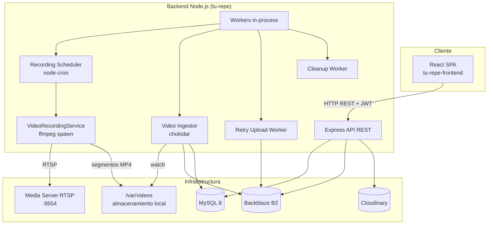
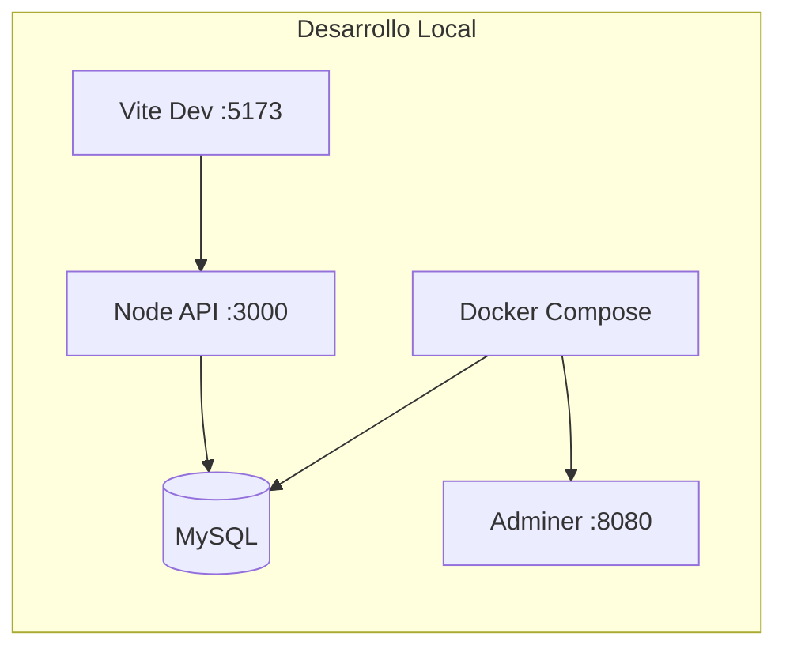
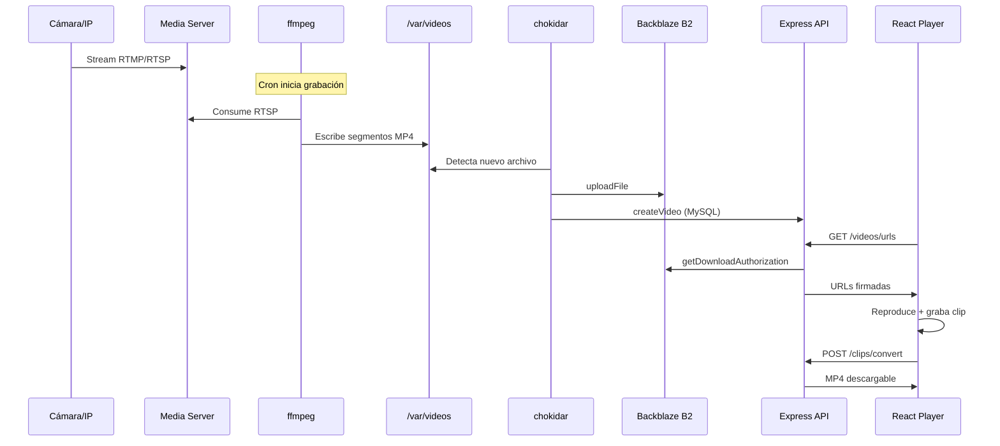
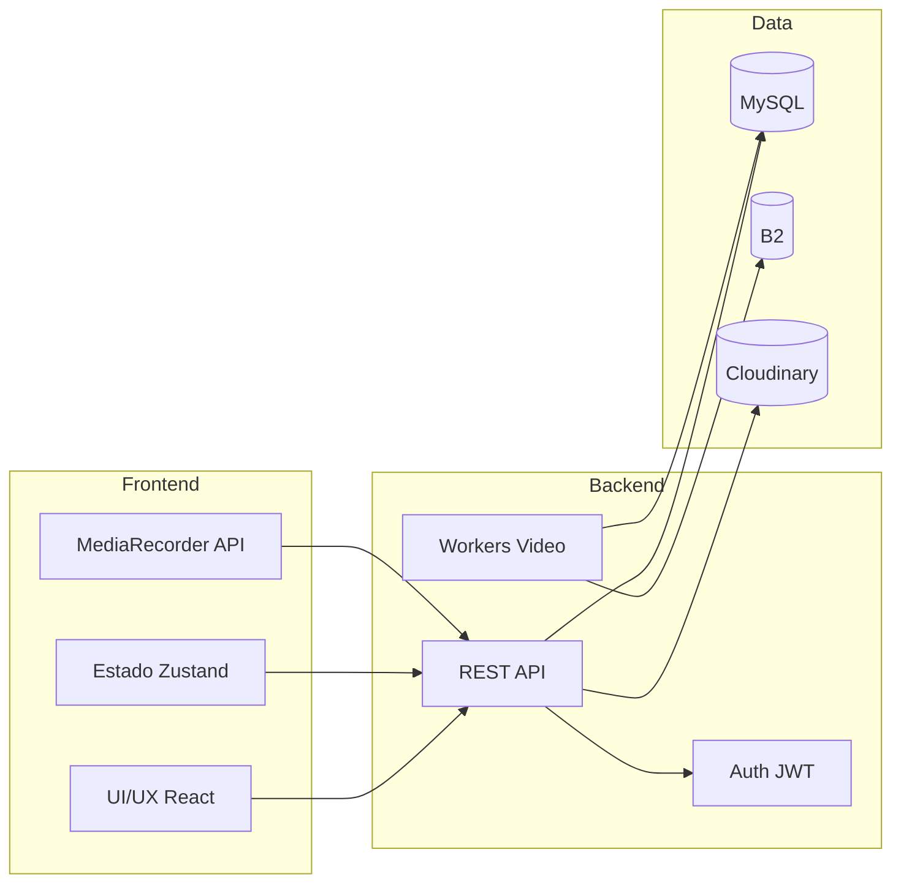

# Análisis Exhaustivo del Proyecto — Tu Repe

> Documento generado mediante inspección completa del código fuente, estructura, dependencias, configuración, base de datos, API, frontend y componentes de infraestructura.
>
> **Fecha de análisis:** Junio 2026  
> **Repositorios analizados:** `tu-repe` (backend) · `tu-repe-frontend` (frontend)

---

# 1. Resumen Ejecutivo

## Nombre del proyecto

**Tu Repe** — plataforma B2B2C para complejos deportivos que graban partidos y permiten a jugadores recuperar y consumir sus repeticiones.

## Objetivo principal

Automatizar la captura, almacenamiento y distribución de videos de partidos deportivos en clubes y complejos, ofreciendo una experiencia pública sencilla para que los jugadores busquen su club, seleccionen fecha/hora/cancha y reproduzcan o descarguen el partido correspondiente.

## Problema de negocio que resuelve

Los complejos deportivos (pádel, fútbol, básquet, etc.) suelen contar con cámaras, pero los jugadores rara vez acceden a las grabaciones de forma autónoma. Tu Repe cierra esa brecha:

- **Para el club:** grabación automática según horario de apertura, almacenamiento en la nube, panel de administración y personalización de marca.
- **Para el jugador:** acceso sin registro al video del partido mediante búsqueda por club, fecha, hora y cancha.
- **Para la operadora (Aedes):** panel centralizado para dar de alta clubes, canchas, usuarios dueños y asignar permisos.

## Tipo de usuarios

| Rol | Descripción |
|-----|-------------|
| **Jugador / visitante público** | Sin autenticación. Busca clubes, ve repeticiones, genera clips y descarga videos. |
| **Prospecto de club** | Interesado en contratar el servicio. Contacto vía WhatsApp (CTA en landing). |
| **Dueño de club** | Usuario autenticado con acceso limitado a los clubes asignados. Edita datos, imágenes, tema y nombres de canchas. |
| **Administrador de plataforma** | Operador interno (Aedes). CRUD completo de clubes, canchas, usuarios y asignaciones. |

## Principales funcionalidades

1. Landing de marketing con búsqueda de clubes y CTA comercial.
2. Perfil público de club con branding personalizable (logo, portada, colores).
3. Búsqueda de videos por fecha, hora y cancha (modelo de "turno").
4. Reproductor de video con velocidad variable, descarga y grabación de clips.
5. Pipeline automático de grabación RTSP → segmentación MP4 → ingesta → Backblaze B2.
6. Panel de administración para operadores de la plataforma.
7. Panel de dueño de club con permisos restringidos.
8. Gestión de imágenes vía Cloudinary.
9. Sistema de reintentos para subidas fallidas a B2.
10. Conversión server-side de clips WebM a MP4 (ffmpeg).

---

# 2. Arquitectura General

## Arquitectura utilizada

**Arquitectura monolítica full-stack desacoplada** con dos aplicaciones independientes:

- **Backend API REST** (Node.js/Express) con workers en proceso para tareas de background.
- **Frontend SPA** (React/Vite) que consume la API vía `fetch`.

No hay microservicios ni message broker; la orquestación de video ocurre in-process mediante cron jobs, file watchers y procesos hijos de ffmpeg.



## Tecnologías empleadas

### Backend (`tu-repe`)

| Categoría | Tecnología |
|-----------|------------|
| Runtime | Node.js |
| Lenguaje | TypeScript 5.9 |
| Framework HTTP | Express 5.1 |
| Base de datos | MySQL 8 (mysql2 con connection pool) |
| Autenticación | JWT (jsonwebtoken) + bcrypt |
| Almacenamiento video | Backblaze B2 |
| Almacenamiento imágenes | Cloudinary |
| Procesamiento video | FFmpeg (fluent-ffmpeg + spawn) |
| Scheduling | node-cron |
| File watching | chokidar |
| Uploads HTTP | multer |
| Testing | Jest + Supertest (50 archivos de test) |
| Dev | ts-node-dev |

### Frontend (`tu-repe-frontend`)

| Categoría | Tecnología |
|-----------|------------|
| Framework UI | React 19 |
| Build tool | Vite 7 |
| Lenguaje | TypeScript 5.9 |
| Routing | React Router 7 |
| Estado global | Zustand 5 |
| Notificaciones | Sonner |
| Estilos | CSS por componente (sin UI library) |
| Tipografía | Figtree (Google Fonts) |

## Frontend

SPA con 6 rutas principales. Arquitectura por **feature folders** dentro de `components/`:

- `Home/` — landing marketing
- `ClubProfile/` — experiencia pública del jugador
- `AdminRoute/` — panel operador
- `UserRoute/` — panel dueño
- `LoginAdmin/` — autenticación dual
- `common/` — componentes reutilizables

La capa de datos se implementa con hooks personalizados (`useFetchData`, `useAdminActions`, `useUserActions`) en lugar de una carpeta `services/` dedicada.

## Backend

Patrón en capas:

```
routes → controllers → services → repositories → MySQL
```

Además:

- **Models** con validación en constructor (Club, Court, Video, User).
- **Validators** dedicados por entidad.
- **Workers** para pipeline de video y resiliencia.
- **Middlewares** para auth y uploads.

## Base de datos

**MySQL 8** con esquema relacional y migraciones SQL versionadas (34 archivos en `database/migrations/`). Runner propio en `database/migrate.ts`.

### Tablas de negocio (6)

| Tabla | Propósito |
|-------|-----------|
| `clubs` | Complejos deportivos con horarios, ubicación, branding y duración de turno |
| `courts` | Canchas con host de cámara, path RTSP y stream key |
| `videos` | Metadatos de grabaciones con ruta en B2 y rango temporal |
| `users` | Dueños de club con credenciales bcrypt |
| `club_users` | Relación N:M usuario-club con rol OWNER |
| `failed_uploads` | Cola de reintentos para subidas fallidas a B2 |

### Tabla de sistema

| Tabla | Propósito |
|-------|-----------|
| `migrations` | Control de migraciones ejecutadas |

## Servicios externos

| Servicio | Uso |
|----------|-----|
| **Backblaze B2** | Almacenamiento de videos MP4. URLs de descarga firmadas (2 horas). |
| **Cloudinary** | Upload y eliminación de imágenes logo/portada de clubes. |
| **FFmpeg** | Grabación RTSP segmentada, conversión WebM→MP4 para clips. |
| **Media Server RTSP** (implícito, ej. MediaMTX) | Recepción de streams en `rtsp://localhost:8554/{cameraPath}`. |
| **WhatsApp** (enlace externo) | Captación comercial de clubes prospectos. |

## Infraestructura y despliegue

**Docker Compose** (`tu-repe/docker-compose.yml`) provee solo infraestructura local:

- `mysql:8.0` en `127.0.0.1:3306` con volumen persistente `./mysql_data`
- `adminer` en `127.0.0.1:8080` para administración visual de BD

**No hay** Dockerfile para la aplicación Node ni pipeline CI/CD visible. El backend escucha en `127.0.0.1:PORT` (default 3000).

**Requisitos de servidor de producción (inferidos):**

- FFmpeg instalado en el host
- Directorio `/var/videos` con permisos de escritura
- Servidor RTSP en puerto 8554
- Variables de entorno configuradas (`.env`)
- Frontend compilado y servido estáticamente (Vite build) o en CDN



---

# 3. Características Funcionales

## 3.1 Landing y marketing

**Descripción:** Página de inicio pública que presenta el producto, permite buscar clubes y canaliza leads comerciales hacia WhatsApp.

**Flujo de uso:**
1. El visitante accede a `/`.
2. Lee secciones informativas (qué es Tu Repe, personalización para clubes, contacto).
3. Puede buscar un club por nombre en el Hero.
4. Al seleccionar un club, navega a `/c/:clubUrlId`.
5. Alternativamente, hace clic en "Sumá Tu Repe" y se abre WhatsApp con mensaje predefinido.

**Tipo de usuario:** Público / prospecto de club.

**Archivos principales:**
- `tu-repe-frontend/src/components/Home/Home.tsx`
- `tu-repe-frontend/src/components/Home/Hero/Hero.tsx`
- `tu-repe-frontend/src/components/Home/WhatIs/WhatIs.tsx`
- `tu-repe-frontend/src/components/Home/Personalization/Personalization.tsx`
- `tu-repe-frontend/src/components/Home/Contact/Contact.tsx`
- `tu-repe-frontend/src/components/Home/Footer/Footer.tsx`
- `tu-repe-frontend/src/openWhatsAppTuRepe.ts`

---

## 3.2 Búsqueda y descubrimiento de clubes

**Descripción:** Listado y filtrado client-side de todos los clubes registrados en la plataforma.

**Flujo de uso:**
1. El Hero carga `GET /clubs`.
2. El usuario escribe en el buscador.
3. Se filtran clubes por nombre (case-insensitive).
4. Clic en resultado → navegación a perfil del club.

**Tipo de usuario:** Jugador público.

**Archivos principales:**
- `tu-repe-frontend/src/components/Home/Hero/Hero.tsx`
- `tu-repe/src/controllers/club.controller.ts`
- `tu-repe/src/services/ClubService.ts`

---

## 3.3 Perfil público de club

**Descripción:** Página branded del club con logo, portada, datos de contacto, ubicación (Google Maps), canchas disponibles y buscador de partidos.

**Flujo de uso:**
1. Acceso vía `/c/:clubUrlId`.
2. Carga club (`GET /clubs/c-url/:urlId`) y canchas (`GET /courts/cl-url/:urlId`).
3. Se aplican colores del tema del club como variables CSS (`--color-primary`, etc.).
4. El jugador selecciona fecha, hora y cancha.
5. Al buscar, consulta `GET /videos/urls?startTime=&courtId=` y obtiene URLs firmadas de B2.

**Tipo de usuario:** Jugador público.

**Archivos principales:**
- `tu-repe-frontend/src/components/ClubProfile/ClubProfile.tsx`
- `tu-repe/src/controllers/video.controller.ts` (endpoint `/urls`)
- `tu-repe/src/services/VideoService.ts` (`getVideoDownloadUrlsForAppointment`)

---

## 3.4 Reproducción y consumo de videos

**Descripción:** Reproductor HTML5 que concatena segmentos de video de un turno, permite cambiar velocidad, descargar partes y grabar clips personalizados.

**Flujo de uso:**
1. Tras la búsqueda, se muestran uno o más segmentos MP4 del turno.
2. El reproductor avanza automáticamente al siguiente segmento al finalizar (`onEnded`).
3. El usuario puede ajustar velocidad (0.5x–2x), descargar la parte actual o grabar un clip de hasta 30 segundos.
4. La grabación usa `MediaRecorder` + `captureStream()` del elemento `<video>`.
5. El clip WebM se envía a `POST /clips/convert` y se descarga como MP4.

**Tipo de usuario:** Jugador público.

**Archivos principales:**
- `tu-repe-frontend/src/components/ClubProfile/MatchVideoPlayer/MatchVideoPlayer.tsx`
- `tu-repe/src/controllers/clip.controller.ts`
- `tu-repe/src/services/ClipConverterService.ts`

---

## 3.5 Modelo de "turno" (appointment)

**Descripción:** No existe tabla de reservas. El concepto de turno se deriva de `appointment_duration` del club (default 60 min) y la hora de inicio seleccionada por el jugador.

**Flujo de uso:**
1. El club define `appointmentDuration` al crearse (ej. 60, 90 min).
2. El jugador indica fecha + hora de inicio de su partido.
3. El backend calcula `endTime = startTime + appointmentDuration`.
4. Se buscan videos de esa cancha cuyo rango temporal intersecte el turno.
5. Se generan URLs firmadas de B2 para cada segmento.

**Tipo de usuario:** Configuración: admin/dueño. Consumo: jugador.

**Archivos principales:**
- `tu-repe/src/services/VideoService.ts`
- `tu-repe/src/repositories/VideoRepository.ts`
- `tu-repe/database/migrations/006_add_appointment_duration_to_clubs.sql`

---

## 3.6 Grabación automática de partidos

**Descripción:** Sistema que inicia y detiene grabaciones ffmpeg según el horario de apertura/cierre de cada club, segmentando en chunks configurables (default 15 min).

**Flujo de uso:**
1. Cron cada minuto (`recordingScheduler`) evalúa hora actual en timezone `America/Argentina/Buenos_Aires`.
2. Para cada club con canchas, verifica si la hora está dentro de `[openTime, closeTime)`.
3. Si debe grabar y no hay proceso activo → `VideoRecordingService.startRecording()`.
4. ffmpeg consume RTSP y escribe segmentos en `/var/videos/club_{id}/court_{id}/`.
5. Al cerrar el club → `stopRecording()` con SIGTERM/SIGKILL.

**Tipo de usuario:** Sistema automatizado (sin intervención humana).

**Archivos principales:**
- `tu-repe/src/workers/recordingScheduler.ts`
- `tu-repe/src/services/VideoRecordingService.ts`
- `tu-repe/src/workers/videoIngestor.ts`

---

## 3.7 Ingesta y almacenamiento en la nube

**Descripción:** Pipeline que detecta nuevos archivos MP4, extrae metadata del nombre, sube a B2 y registra en MySQL.

**Flujo de uso:**
1. chokidar detecta nuevo `.mp4` en `/var/videos/**/**/*.mp4`.
2. Espera estabilidad del archivo (`STABILITY_THRESHOLD`, default 10s).
3. Parsea nombre: `cancha{id}_{YYYY-MM-DD}_{HH-MM-SS}.mp4`.
4. Sube a B2 en `club_{clubId}/court_{courtId}/{fileName}`.
5. Crea registro en tabla `videos`.
6. Si falla la subida → registra en `failed_uploads`.

**Tipo de usuario:** Sistema automatizado.

**Archivos principales:**
- `tu-repe/src/workers/videoIngestor.ts`
- `tu-repe/src/services/B2Service.ts`
- `tu-repe/src/utils/extractMetadataFromFileName.ts`
- `tu-repe/src/services/FailedUploadService.ts`

---

## 3.8 Reintentos de subida fallida

**Descripción:** Worker que reintenta subidas a B2 con backoff exponencial escalonado.

**Flujo de uso:**
1. Cada 5 minutos, procesa registros `pending`/`retrying` en `failed_uploads`.
2. Respeta intervalos: 1m → 5m → 15m → 1h → 6h → 24h.
3. Máximo 10 intentos; luego marca `failed_permanently`.
4. Cleanup worker elimina archivos locales de fallos permanentes > 3 días.

**Tipo de usuario:** Sistema automatizado.

**Archivos principales:**
- `tu-repe/src/workers/retryUploadWorker.ts`
- `tu-repe/src/workers/cleanupWorker.ts`
- `tu-repe/src/services/FailedUploadService.ts`

---

## 3.9 Gestión de clubes (admin)

**Descripción:** CRUD completo de clubes con datos operativos, imágenes, tema y horarios.

**Flujo de uso:**
1. Admin inicia sesión en `/login-admin`.
2. Accede a `/admin`.
3. Crea/edita/elimina clubes con nombre, ubicación, horarios, duración de turno.
4. Sube logo y portada (Cloudinary).
5. Configura tema de colores (primary, secondary, background).

**Tipo de usuario:** Administrador de plataforma.

**Archivos principales:**
- `tu-repe-frontend/src/components/AdminRoute/AdminInterface/`
- `tu-repe-frontend/src/hooks/useAdminActions.ts`
- `tu-repe-frontend/src/stores/adminStore.ts`
- `tu-repe/src/routes/club.routes.ts`
- `tu-repe/src/services/ClubService.ts`
- `tu-repe/src/services/CloudinaryService.ts`

---

## 3.10 Gestión de canchas (admin)

**Descripción:** Alta de canchas con generación automática de `streamKey` y `cameraPath` para integración RTMP/RTSP.

**Flujo de uso:**
1. Admin selecciona un club y crea cancha con nombre y `cameraHost`.
2. Backend genera `streamKey` único y `cameraPath` (`club_{id}/{streamKey}`).
3. Crea directorios en `/var/videos/club_{id}/court_{id}/`.
4. Webhook RTMP (`POST /courts/rtmp/start`) valida stream key al publicar.

**Tipo de usuario:** Administrador de plataforma.

**Archivos principales:**
- `tu-repe-frontend/src/components/AdminRoute/AdminInterface/CourtsForm/CourtsForm.tsx`
- `tu-repe/src/controllers/court.controller.ts`
- `tu-repe/src/services/CourtService.ts`

---

## 3.11 Gestión de usuarios y asignación de dueños

**Descripción:** CRUD de usuarios dueños de club y asignación N:M mediante tabla `club_users`.

**Flujo de uso:**
1. Admin crea usuario con email/password.
2. Asigna usuario como OWNER de uno o más clubes (`POST /users/cu`).
3. El dueño puede iniciar sesión en `/login-user` y acceder a `/user`.
4. Admin puede desasignar (`DELETE /users/cu`) o eliminar usuario.

**Tipo de usuario:** Administrador (gestión) · Dueño (consumo).

**Archivos principales:**
- `tu-repe-frontend/src/components/AdminRoute/AdminInterface/UserDetails/UserDetails.tsx`
- `tu-repe/src/routes/user.routes.ts`
- `tu-repe/src/services/UserService.ts`

---

## 3.12 Panel de dueño de club

**Descripción:** Interfaz restringida para que dueños editen solo sus clubes asignados.

**Flujo de uso:**
1. Dueño inicia sesión → token `access_token_user` en localStorage.
2. `UserRoute` valida sesión con `GET /auth/user/check-user`.
3. Carga clubes con `GET /users/clubs`.
4. Puede editar datos del club, tema, imágenes y **renombrar** canchas (no crear ni eliminar).

**Tipo de usuario:** Dueño de club.

**Archivos principales:**
- `tu-repe-frontend/src/components/UserRoute/UserInterface/`
- `tu-repe-frontend/src/hooks/useUserActions.ts`
- `tu-repe-frontend/src/stores/userStore.ts`
- `tu-repe/src/middlewares/auth.middleware.ts` (`requireOwnerOfClub`, `requireOwnerOfCourt`)

---

## 3.13 Personalización de marca (white-label parcial)

**Descripción:** Cada club puede tener logo, portada y paleta de colores que se reflejan en su perfil público.

**Flujo de uso:**
1. Admin o dueño sube imágenes vía endpoints con contexto `logo` o `cover`.
2. Configura tema JSON: `{ primary, secondary, background }`.
3. El perfil público aplica variables CSS dinámicamente.

**Tipo de usuario:** Admin · Dueño de club.

**Archivos principales:**
- `tu-repe-frontend/src/components/AdminRoute/AdminInterface/ClubDetails/Personalization/`
- `tu-repe-frontend/src/components/ClubProfile/ClubProfile.tsx` (aplicación de tema)
- `tu-repe/database/migrations/015_add_theme_to_clubs.sql`

---

## 3.14 Autenticación dual

**Descripción:** Dos flujos de login independientes con JWT y roles distintos.

**Flujo de uso:**
- **Admin:** `POST /auth/admin/login` con credenciales de entorno → JWT 2h → `access_token`.
- **Dueño:** `POST /auth/user/login` con email/password de BD → JWT 7d → `access_token_user`.
- Guards en frontend verifican token con endpoints `check-admin` / `check-user`.

**Tipo de usuario:** Admin · Dueño.

**Archivos principales:**
- `tu-repe/src/controllers/auth.controller.ts`
- `tu-repe/src/middlewares/auth.middleware.ts`
- `tu-repe-frontend/src/components/LoginAdmin/LoginAdmin.tsx`
- `tu-repe-frontend/src/components/AdminRoute/AdminRoute.tsx`
- `tu-repe-frontend/src/components/UserRoute/UserRoute.tsx`

---

# 4. Características Técnicas

## APIs implementadas

REST API JSON sobre Express 5 con prefijos:

| Prefijo | Dominio |
|---------|---------|
| `/auth` | Autenticación |
| `/clubs` | Clubes |
| `/courts` | Canchas |
| `/videos` | Videos |
| `/clips` | Conversión de clips |
| `/users` | Usuarios y permisos de dueño |

## Endpoints (45 total)

### Raíz
| Método | Ruta | Auth | Descripción |
|--------|------|------|-------------|
| GET | `/` | — | Health check |

### Auth (`/auth`)
| Método | Ruta | Auth | Descripción |
|--------|------|------|-------------|
| POST | `/auth/admin/login` | — | Login admin |
| GET | `/auth/admin/check-admin` | Bearer admin | Verificar sesión admin |
| POST | `/auth/user/login` | — | Login dueño |
| GET | `/auth/user/check-user` | Bearer user | Verificar sesión dueño |

### Clubs (`/clubs`)
| Método | Ruta | Auth | Descripción |
|--------|------|------|-------------|
| POST | `/clubs` | Admin | Crear club |
| GET | `/clubs` | — | Listar clubes |
| GET | `/clubs/c/:id` | — | Club por publicId |
| GET | `/clubs/c-url/:urlId` | — | Club por urlId |
| GET | `/clubs/with-courts` | — | Clubes con canchas |
| PUT | `/clubs/c/:id` | Admin | Actualizar club |
| PUT | `/clubs/c/:id/theme` | Admin | Actualizar tema |
| PUT | `/clubs/c/:id/:context` | Admin | Subir imagen (logo/cover) |
| DELETE | `/clubs/c/:id/:context` | Admin | Eliminar imagen |
| DELETE | `/clubs/c/:id` | Admin | Eliminar club |

### Courts (`/courts`)
| Método | Ruta | Auth | Descripción |
|--------|------|------|-------------|
| POST | `/courts` | Admin | Crear cancha |
| POST | `/courts/rtmp/start` | — | Webhook validación RTMP |
| GET | `/courts` | — | Listar canchas |
| GET | `/courts/c/:id` | — | Cancha por publicId |
| GET | `/courts/cl/:id` | — | Canchas de un club |
| GET | `/courts/cl-url/:urlId` | — | Canchas por urlId del club |
| PUT | `/courts/c/:id` | — | Actualizar nombre |
| PUT | `/courts/c/:id/admin` | Admin | Actualizar name, cameraHost |
| DELETE | `/courts/c/:id` | Admin | Eliminar cancha |

### Videos (`/videos`)
| Método | Ruta | Auth | Descripción |
|--------|------|------|-------------|
| POST | `/videos` | Admin | Crear video manualmente |
| GET | `/videos` | — | Listar todos |
| GET | `/videos/v/:id` | — | Video por publicId |
| GET | `/videos/c/:courtId` | — | Videos de cancha |
| GET | `/videos/range` | — | Por rango de fechas |
| GET | `/videos/urls` | — | URLs firmadas del turno |
| PUT | `/videos/v/:id` | — | Actualizar video |
| DELETE | `/videos/v/:id` | Admin | Eliminar video |

### Clips (`/clips`)
| Método | Ruta | Auth | Descripción |
|--------|------|------|-------------|
| POST | `/clips/convert` | — | Convertir WebM a MP4 |

### Users (`/users`)
| Método | Ruta | Auth | Descripción |
|--------|------|------|-------------|
| POST | `/users` | Admin | Crear usuario |
| POST | `/users/cu` | Admin | Asignar dueño a club |
| GET | `/users` | Admin | Usuarios con clubes |
| GET | `/users/clubs` | User | Clubes del usuario |
| PUT | `/users/c/:id` | User + owner | Actualizar club propio |
| PUT | `/users/c/:id/theme` | User + owner | Tema del club propio |
| PUT | `/users/u/:id` | Admin | Actualizar usuario |
| PUT | `/users/c/:id/:context` | User + owner | Subir imagen club |
| PUT | `/users/court/:id` | User + owner court | Actualizar cancha |
| DELETE | `/users/u/:id` | Admin | Eliminar usuario |
| DELETE | `/users/cu` | Admin | Desasignar dueño |
| DELETE | `/users/c/:id/:context` | User + owner | Eliminar imagen |

## Middleware

| Middleware | Archivo | Función |
|------------|---------|---------|
| `authAdmin` | `auth.middleware.ts` | Verifica JWT con rol `admin` |
| `authUser` | `auth.middleware.ts` | Verifica JWT con rol `user`, adjunta `req.user` |
| `requireOwnerOfClub` | `auth.middleware.ts` | Verifica ownership en `club_users` |
| `requireOwnerOfCourt` | `auth.middleware.ts` | Verifica que cancha pertenezca a club del usuario |
| `uploadImages` | `upload.middleware.ts` | Multer memory, max 10MB para imágenes |
| `uploadWebm` | `upload.middleware.ts` | Multer disk para clips WebM, max 50MB |
| CORS | `index.ts` | Restringido a `FRONTEND_URL` con credentials |

## Validaciones

- **Models:** Validación en constructor al instanciar entidades (`Club`, `Court`, `Video`, `User`).
- **Validators:** Clases dedicadas (`ClubValidator`, `CourtValidator`, etc.) extendiendo `BaseValidator`.
- **Services:** Reglas de negocio (videos solapados, duplicados por fileName/b2FilePath, court/club existente).
- **Multer:** Límites de tamaño en uploads.
- **JWT:** Verificación de rol en cada middleware.

## Autenticación

- **Admin:** Credenciales estáticas en variables de entorno (`ADMIN_EMAIL`, `ADMIN_PASSWORD`). Sin registro en BD.
- **Dueño:** Email + password hasheado con bcrypt (cost factor default).
- **Tokens:** JWT firmado con `JWT_SECRET`. Payload incluye `role` y opcionalmente `userId`.
- **Frontend:** Tokens en `localStorage` (`access_token`, `access_token_user`).

## Autorización

Modelo RBAC simplificado:

| Rol | Alcance |
|-----|---------|
| `admin` | Acceso total a CRUD de clubes, canchas, usuarios |
| `user` (OWNER) | Solo clubes asignados en `club_users` |
| Público | Lectura de clubes, canchas, videos y conversión de clips |

Autorización granular implementada con middleware async que consulta BD antes de ejecutar controller.

## Gestión de estados

### Backend
- Estado en memoria de grabaciones activas: `VideoRecordingService.activeRecordings` (Map).
- Sin Redis ni cache distribuido.

### Frontend
- **Zustand:** `adminStore` (listas, modales, loading flags) y `userStore` (usuario, clubes, formularios).
- **useState local:** Datos de pantalla (club, videos, búsqueda).
- **useFormData:** Estado de formularios controlados genérico.

## Gestión de errores

- **Controllers:** try/catch con `res.status(4xx/5xx).json({ message })`.
- **Repositories:** Envuelven errores SQL con mensajes descriptivos.
- **Workers:** Log de errores sin detener el proceso; cron continúa en siguiente tick.
- **Frontend:** `useFetchData` retorna `null` en error; componentes muestran toast Sonner o UI de fallback.

## Persistencia de datos

- **MySQL** vía connection pool (`mysql2/promise`).
- **Patrón Repository** con `BaseRepository` abstracto: mapeo camelCase ↔ snake_case, generación automática de `public_id` (UUID).
- **Migraciones SQL** versionadas con runner idempotente.
- **IDs públicos:** La API expone `publicId` como campo `id`; IDs numéricos internos nunca se exponen.

## Integraciones externas

| Integración | Patrón | Detalle técnico |
|-------------|--------|-----------------|
| Backblaze B2 | SDK `backblaze-b2` | authorize → getUploadUrl → uploadFile. URLs firmadas con `getDownloadAuthorization` (2h). |
| Cloudinary | SDK `cloudinary` v2 | `upload_stream` desde buffer, `destroy` para eliminación. |
| FFmpeg | spawn + fluent-ffmpeg | Grabación RTSP segmentada; conversión WebM→MP4 con preset veryfast. |
| RTSP/Media | Webhook + URL fija | `rtsp://localhost:8554/{cameraPath}` |

## Configuración de entornos

| Variable | Propósito |
|----------|-----------|
| `PORT` | Puerto del servidor (default 3000) |
| `FRONTEND_URL` | Origen CORS permitido |
| `MYSQL_HOST`, `MYSQL_DATABASE`, `MYSQL_USER`, `MYSQL_PASSWORD` | Conexión BD |
| `B2_APPLICATION_KEY_ID`, `B2_APPLICATION_KEY`, `B2_BUCKET_ID`, `B2_BUCKET_NAME` | Backblaze B2 |
| `CLOUDINARY_CLOUD_NAME`, `CLOUDINARY_API_KEY`, `CLOUDINARY_API_SECRET` | Cloudinary |
| `JWT_SECRET` | Firma de tokens |
| `ADMIN_EMAIL`, `ADMIN_PASSWORD` | Login admin |
| `STABILITY_THRESHOLD` | Ms de estabilidad antes de ingerir archivo (default 10000) |
| `VIDEO_CHUNK_DURATION_MS` | Duración de segmentos de grabación (default 900000 = 15 min) |
| `ENCRYPTION_PASSWORD` | Legacy (EncryptionService sin uso actual) |
| `VITE_BACKEND_API_URL` | URL API en frontend |
| `VITE_DEFAULT_COVER_IMAGE_URL` | Imagen portada por defecto |
| `VITE_DEFAULT_PROFILE_IMAGE_URL` | Imagen logo por defecto |

Entornos:
- **Desarrollo:** `.env` + `.env` frontend
- **Test:** `.env.test` (activado con `NODE_ENV=test`)

---

# 5. Decisiones de Ingeniería

## Por qué se eligieron determinadas tecnologías

| Decisión | Justificación inferida |
|----------|------------------------|
| **Express + TypeScript** | Ecosistema maduro, tipado para proyecto de mediana complejidad, curva de aprendizaje baja. |
| **MySQL relacional** | Modelo de datos claramente relacional (clubes → canchas → videos, usuarios → clubes). Migraciones SQL explícitas dan control total del esquema. |
| **Sin ORM (repositories raw SQL)** | Queries específicas (rangos de fechas, solapamiento de videos) y menor overhead. Patrón Repository custom con mapeo automático. |
| **Backblaze B2 vs S3** | Almacenamiento de video costo-efectivo; URLs de descarga autorizadas sin exponer bucket públicamente. |
| **Cloudinary para imágenes** | Transformaciones, CDN y gestión de `public_id` out-of-the-box para logos/portadas. |
| **Workers in-process vs cola externa** | Simplicidad operativa para MVP; suficiente para escala inicial de clubes. Trade-off: no hay escalado horizontal de workers sin coordinación. |
| **React + Vite (sin UI library)** | Control total del diseño, bundle liviano, CSS custom alineado con branding Aedes. |
| **Zustand vs Redux** | Estado global mínimo necesario; API simple sin boilerplate. |
| **UUID públicos (public_id)** | Seguridad por oscuridad de IDs secuenciales; URLs estables y no enumerables. |
| **url_id corto (12 hex)** | URLs amigables para compartir (`/c/abc123def456`) sin exponer UUID completo. |

## Patrones utilizados

| Patrón | Implementación |
|--------|----------------|
| **Layered Architecture** | routes → controllers → services → repositories |
| **Repository** | `BaseRepository<T>` con CRUD genérico y mapeo de campos |
| **Domain Model** | Clases `Club`, `Court`, etc. con validación en construcción |
| **Service Layer** | Lógica de negocio encapsulada (solapamiento, turnos, ownership) |
| **Middleware Chain** | Auth + ownership + upload en cadena Express |
| **Background Worker** | Cron + setInterval + file watcher |
| **Feature Folders** | Frontend organizado por dominio funcional |
| **Custom Hooks** | Abstracción de fetch y acciones de dominio |
| **Guard Routes** | `AdminRoute` / `UserRoute` como HOCs de protección |

## Organización del proyecto

Monorepo informal con dos carpetas hermanas:

```
Tu Repe/
├── tu-repe/              # Backend API + workers + migraciones
├── tu-repe-frontend/     # SPA React
└── PROJECT_ANALYSIS.md   # Este documento
```

Backend sigue convención por tipo técnico (`controllers/`, `services/`, `repositories/`). Frontend sigue convención por feature (`components/Home/`, `components/ClubProfile/`).

## Estrategias de escalabilidad

**Implementadas:**
- Segmentación de video en chunks de 15 min (reduce tamaño de archivos individuales y permite paralelizar descargas).
- Almacenamiento en B2 (escala de almacenamiento delegada al proveedor).
- Connection pool MySQL.
- URLs firmadas con expiración (no proxy de video a través del backend).

**Limitaciones actuales (oportunidades de escala):**
- Grabaciones ffmpeg en el mismo proceso Node (cuello de botella CPU por cancha).
- Workers in-process sin distribución.
- Sin CDN para frontend.
- Sin cache de consultas frecuentes (listado de clubes).
- Servidor escucha solo en `127.0.0.1` (requiere reverse proxy en producción).

## Estrategias de mantenibilidad

- **Migraciones versionadas:** Evolución de esquema trazable (34 migraciones incrementales).
- **Tests extensivos:** 50 archivos de test (unit + integration) con Jest.
- **Separación de concerns:** Controllers delgados, lógica en services.
- **Tipado TypeScript** en ambos extremos con interfaces compartidas conceptualmente (`IClub`, `ICourt`, etc.).
- **Config centralizada:** `config.ts` como único punto de lectura de env vars.
- **Public ID mapping:** Utilidad `mapPublicId` centraliza transformación de respuestas API.

---

# 6. Problemas Técnicos Resueltos

## 6.1 Grabación continua de múltiples canchas

| Aspecto | Detalle |
|---------|---------|
| **Problema** | Un club puede tener N canchas, cada una con stream RTSP independiente. Se necesita grabar simultáneamente solo durante horario de operación. |
| **Impacto** | Sin automatización, las grabaciones dependerían de intervención manual o scripts externos. |
| **Solución** | `recordingScheduler` con cron cada minuto + `VideoRecordingService` con Map de procesos ffmpeg por `courtId`. Evaluación de timezone Argentina y rangos que cruzan medianoche. |
| **Beneficio** | Grabación 100% automática alineada al horario comercial de cada club. |

## 6.2 Segmentación de videos largos

| Aspecto | Detalle |
|---------|---------|
| **Problema** | Un partido puede durar 60–90+ minutos; un archivo monolítico es difícil de subir, servir y recuperar ante fallos. |
| **Impacto** | Timeouts en subida, archivos corruptos por interrupciones, mala UX de descarga. |
| **Solución** | ffmpeg con `-f segment -segment_time` y patrón de nombre con timestamp (`cancha{id}_%Y-%m-%d_%H-%M-%S.mp4`). Duración configurable vía `VIDEO_CHUNK_DURATION_MS`. |
| **Beneficio** | Archivos manejables (~15 min), reintentos granulares y reproducción secuencial en frontend. |

## 6.3 Ingesta confiable de archivos en escritura

| Aspecto | Detalle |
|---------|---------|
| **Problema** | ffmpeg escribe archivos incrementalmente; procesar antes de que termine la escritura corrompe la ingesta. |
| **Impacto** | Subidas de archivos incompletos a B2, registros de video inválidos. |
| **Solución** | chokidar con `awaitWriteFinish.stabilityThreshold` (10s default) + cálculo de `endTime` descontando threshold. |
| **Beneficio** | Ingesta solo de archivos completos y estables. |

## 6.4 Fallos de red en subida a B2

| Aspecto | Detalle |
|---------|---------|
| **Problema** | Subidas a cloud storage pueden fallar por red, rate limits o indisponibilidad temporal. |
| **Impacto** | Pérdida permanente de grabaciones si solo se intenta una vez. |
| **Solución** | Tabla `failed_uploads` + worker con backoff escalonado (1m→24h), máximo 10 intentos, cleanup de fallos permanentes. |
| **Beneficio** | Resiliencia ante fallos transitorios; trazabilidad de errores. |

## 6.5 Búsqueda de partido sin sistema de reservas

| Aspecto | Detalle |
|---------|---------|
| **Problema** | Los clubes no tienen sistema de reservas integrado, pero los jugadores conocen fecha/hora de su partido. |
| **Impacto** | No se puede vincular video a una reserva en BD. |
| **Solución** | Modelo de "turno" basado en `appointment_duration` + consulta por rango temporal de videos en cancha. Endpoint `GET /videos/urls`. |
| **Beneficio** | UX simple para el jugador sin requerir integración con sistemas de reservas de terceros. |

## 6.6 Exposición segura de IDs

| Aspecto | Detalle |
|---------|---------|
| **Problema** | IDs auto-incrementales son enumerables y revelan volumen de datos. |
| **Impacto** | Riesgo de scraping y acceso no autorizado por iteración. |
| **Solución** | Migraciones 017–034 introducen `public_id` (UUID) en todas las entidades; API mapea `publicId` → `id` en respuestas. `url_id` corto para URLs públicas. |
| **Beneficio** | IDs no predecibles; URLs compartibles sin exponer estructura interna. |

## 6.7 Clips de video en el navegador

| Aspecto | Detalle |
|---------|---------|
| **Problema** | Los jugadores quieren fragmentos cortos (highlights), pero el video fuente es MP4 remoto en B2. |
| **Impacto** | Edición server-side de rangos arbitrarios sería costosa en CPU y latencia. |
| **Solución** | `MediaRecorder` + `HTMLVideoElement.captureStream()` en frontend; conversión WebM→MP4 en backend con ffmpeg. Límite de 30s por clip. |
| **Beneficio** | Clips generados client-side (bajo costo servidor); formato MP4 universal al descargar. |

## 6.8 Autorización multi-tenant para dueños

| Aspecto | Detalle |
|---------|---------|
| **Problema** | Un dueño puede gestionar varios clubes; otro dueño no debe ver ni editar clubes ajenos. |
| **Impacto** | Riesgo de fuga de datos entre tenants. |
| **Solución** | Tabla `club_users` + middleware `requireOwnerOfClub` / `requireOwnerOfCourt` que consulta BD en cada request protegido. |
| **Beneficio** | Aislamiento de datos por dueño sin complejidad de roles múltiples. |

## 6.9 Personalización white-label por club

| Aspecto | Detalle |
|---------|---------|
| **Problema** | Cada club quiere su identidad visual en la página pública. |
| **Impacto** | Percepción genérica reduce adopción del club. |
| **Solución** | Campo JSON `theme` en BD + upload de imágenes a Cloudinary + aplicación dinámica de CSS variables en `ClubProfile`. |
| **Beneficio** | Cada club tiene página con su marca sin deploy separado. |

## 6.10 Validación de streams RTMP

| Aspecto | Detalle |
|---------|---------|
| **Problema** | Cualquier dispositivo podría intentar publicar video al media server. |
| **Impacto** | Streams no autorizados, consumo de recursos. |
| **Solución** | Webhook `POST /courts/rtmp/start` que valida `streamKey` contra BD antes de aceptar publicación. |
| **Beneficio** | Solo cámaras registradas de clubes activos pueden transmitir. |

---

# 7. Complejidades Técnicas Destacables

## Pipeline de video end-to-end

El flujo RTSP → ffmpeg segmentado → filesystem → chokidar → B2 → MySQL → URL firmada → reproductor HTML5 → MediaRecorder → conversión MP4 es un pipeline de **7 etapas** que involucra procesos del sistema operativo, red, almacenamiento cloud y UI del navegador. Demuestra competencia en **ingeniería de multimedia**.



## Manejo de fechas y timezones

- Scheduler usa timezone explícita `America/Argentina/Buenos_Aires` para horarios de club.
- Soporte de horarios que cruzan medianoche (`closeTime < openTime`).
- Frontend envía `startTime` como ISO UTC; backend calcula ventana del turno.
- Metadata de archivos parseada desde nombre con sufijo `Z` (UTC).
- Utilidad `getDateInUTC` para normalización.

## Concurrencia y procesos

- Map en memoria de grabaciones activas con gestión de SIGTERM/SIGKILL.
- File watcher async con procesamiento secuencial por evento `add`.
- Worker de reintentos con intervalos no solapados por registro (verificación `shouldRetry`).
- Validación de videos solapados en `VideoService.createVideo` para evitar duplicados.

## Optimización

- ffmpeg preset `veryfast` para balance CPU/calidad en grabación en vivo.
- `-movflags +faststart` para streaming progresivo de MP4.
- Eliminación de archivo local post-subida exitosa a B2 (ahorro de disco).
- Segmentos de 15 min en lugar de archivos monolíticos.
- Pool de conexiones MySQL reutilizable.

## Seguridad

- JWT con roles y expiración diferenciada (admin 2h, user 7d).
- bcrypt para passwords de dueños.
- CORS restringido a `FRONTEND_URL`.
- IDs públicos UUID no enumerables.
- URLs de B2 firmadas con expiración de 2 horas.
- Middleware de ownership async antes de mutaciones.
- Admin credentials solo en env (no en BD).
- Validación de stream keys en webhook RTMP.

## Diseño de base de datos

- Relaciones FK con `ON DELETE CASCADE` (eliminar club → canchas → videos).
- Migración incremental de 34 pasos evidencia evolución orgánica del producto.
- Tabla de cola (`failed_uploads`) separada del dominio principal.
- Índices UNIQUE en `public_id`, `url_id`, `stream_key`, `email`.
- Campo JSON para tema (flexibilidad sin migraciones por cada color).

## Integraciones

- Tres proveedores cloud distintos (MySQL local/docker, B2, Cloudinary) con abstracción en services.
- Integración con media server vía webhook (desacoplamiento del vendor específico).

## Despliegue

- Docker solo para BD (separación de concerns).
- App Node diseñada para correr en host con ffmpeg (workload de media).
- Variables de entorno para configuración 12-factor.

## Sincronización frontend/backend

- Contrato API basado en `publicId` como `id`.
- Tipos TypeScript espejo en frontend (`types.d.ts`) y backend (`types.d.ts`).
- Tema del club: JSON en BD → CSS variables en frontend.
- Conversión de timezone en búsqueda de videos (local → UTC ISO).

## Testing

- 50 archivos de test cubriendo unit (services, workers, B2) e integration (endpoints con Supertest).
- Tests de ingesta de video incluyendo escenarios de fallo.
- Schema SQL dedicado para tests (`tests/schema.sql`).

---

# 8. Métricas del Proyecto

## Backend (`tu-repe`)

| Métrica | Cantidad |
|---------|----------|
| Archivos TypeScript en `src/` | 57 |
| Servicios | 11 |
| Routers (módulos de rutas) | 6 |
| Controllers | 6 |
| Repositories | 7 (5 entidades + Base + index) |
| Models (clases de dominio) | 4 |
| Middlewares | 2 |
| Workers | 4 |
| Validators | 5 |
| Migraciones SQL | 34 |
| Endpoints HTTP | 45 |
| Tablas de negocio | 6 |
| Tablas totales (incl. migrations) | 7 |
| Entidades de dominio | 5 (Club, Court, Video, User, FailedUpload) |
| Archivos de test | 50 |
| Dependencias de producción | 14 |

## Frontend (`tu-repe-frontend`)

| Métrica | Cantidad |
|---------|----------|
| Rutas (`<Route>`) | 6 |
| Pantallas principales | 5 (Home, ClubProfile, LoginAdmin, AdminInterface, UserInterface) |
| Componentes React en `components/` | 30 |
| Archivos `.tsx` en `src/` | 42 |
| Hooks personalizados | 4 |
| Stores Zustand | 2 |
| Servicios dedicados | 0 (lógica en hooks) |
| Módulos npm (dependencies) | 5 |

## Totales combinados

| Métrica | Cantidad |
|---------|----------|
| **Endpoints API** | 45 |
| **Componentes UI** | 30 |
| **Pantallas** | 5 |
| **Servicios backend** | 11 |
| **Rutas frontend** | 6 |
| **Módulos de rutas backend** | 6 |
| **Entidades/tables** | 6 + 1 sistema |
| **Tests automatizados** | 50 archivos |

---

# 9. Mi Participación Como Desarrollador

> Sección orientada a portfolio profesional. Ajustá los tiempos y el rol exacto según tu participación real.

## Habilidades que demuestra el proyecto

| Área | Evidencia en el proyecto |
|------|--------------------------|
| **Desarrollo Full Stack** | Backend API completo + SPA React con autenticación, paneles y experiencia pública |
| **Ingeniería de video** | Pipeline RTSP → ffmpeg → ingesta → cloud storage → reproductor → clips |
| **Arquitectura de software** | Capas bien definidas, repositories, services, workers, validación de dominio |
| **Bases de datos** | Diseño relacional, 34 migraciones, queries por rango temporal, multi-tenant |
| **Integración cloud** | Backblaze B2, Cloudinary, URLs firmadas, gestión de assets |
| **Seguridad** | JWT dual, bcrypt, autorización granular, IDs públicos, CORS |
| **Resiliencia** | Cola de reintentos con backoff, cleanup de fallos, estabilidad de archivos |
| **Testing** | 50 tests unitarios e integración con Jest/Supertest |
| **UX/Producto** | Landing, búsqueda, reproductor con clips, white-label por club |
| **DevOps básico** | Docker Compose, variables de entorno, scripts de migración |

## Conocimientos técnicos evidenciados

- TypeScript avanzado en frontend y backend.
- Express 5 middleware chains y manejo de uploads multipart.
- Procesos hijo con ffmpeg (spawn) y fluent-ffmpeg.
- File system watching con chokidar y patrones de estabilidad.
- Cron jobs y workers in-process en Node.js.
- React 19 hooks, estado con Zustand, routing protegido.
- APIs RESTful con convenciones de URL y mapeo de IDs.
- MediaRecorder API y captureStream en navegadores.
- SQL raw con connection pooling y patrón Repository genérico.
- Gestión de timezones y rangos horarios.

## Problemas de negocio resueltos

1. **Acceso democratizado a repeticiones:** Cualquier jugador encuentra su partido sin cuenta ni app.
2. **Operación automatizada para clubes:** Grabación según horario sin intervención humana.
3. **Onboarding escalable de clubes:** Panel admin para alta masiva de clubes, canchas y dueños.
4. **Marca propia del club:** Personalización visual sin desarrollo adicional por cliente.
5. **Monetización indirecta:** CTAs a WhatsApp para captación de nuevos clubes.

## Capacidades Full Stack demostradas



El desarrollador demuestra capacidad para **diseñar, implementar y conectar** todas las capas: desde la experiencia del jugador en el navegador hasta la grabación automatizada en servidor y persistencia en cloud storage.

---

# 10. Aprendizajes y Evolución

## Conceptos avanzados aplicados

1. **Pipeline de ingesta de media** con file watchers y estabilidad de escritura.
2. **Backoff exponencial** para reintentos de operaciones idempotentes.
3. **Multi-tenancy ligero** con ownership en tabla de unión.
4. **Ocultamiento de IDs internos** con capa de mapeo publicId.
5. **Segmentación de video** para resiliencia y UX.
6. **Autorización a nivel de recurso** (no solo rol global).
7. **Conversión de formatos de video** server-side bajo demanda.
8. **CSS theming dinámico** desde datos de API.

## Aprendizajes que deja el proyecto

- Los pipelines de video requieren pensar en **fallos parciales** (red, disco, proceso) desde el diseño, no como afterthought.
- Separar almacenamiento de video (B2) de imágenes (Cloudinary) optimiza costos y capacidades por tipo de asset.
- Un modelo de "turno" sin reservas puede ser suficiente para MVP si la UX de búsqueda es clara.
- Los workers in-process son válidos para MVP pero definen un límite claro de escalabilidad.
- La migración incremental de `public_id` en 18 migraciones (017–034) muestra cómo evolucionar APIs sin breaking changes bruscos.

## Mejoras para una versión futura

| Área | Mejora sugerida |
|------|----------------|
| **Escalabilidad** | Extraer workers a procesos/contenedores separados; cola con Redis/BullMQ |
| **Observabilidad** | Logging estructurado, métricas (Prometheus), alertas de grabaciones caídas |
| **CI/CD** | Pipeline automatizado con tests, build y deploy |
| **Frontend** | React Query para cache/refetch; unificar paneles admin/user (mucho código duplicado) |
| **Seguridad** | Refresh tokens, rate limiting, HTTPS enforcement |
| **Video** | Streaming adaptativo (HLS) en lugar de descarga de MP4 completos |
| **Producto** | Integración con sistemas de reservas; notificaciones al jugador |
| **Infra** | Dockerfile para app, nginx reverse proxy, CDN para frontend |
| **Dependencias** | Declarar `chokidar` explícitamente en `package.json` |
| **Testing frontend** | Agregar tests con Vitest/Testing Library |
| **Documentación** | OpenAPI/Swagger para contrato API |

---

# 11. Resumen Para Portfolio

## Descripción breve

**Tu Repe** es una plataforma full-stack que permite a complejos deportivos grabar automáticamente los partidos de sus canchas y ofrecer a los jugadores acceso instantáneo a las repeticiones mediante una web pública personalizable.

## Problema resuelto

Los jugadores de deportes amateur y semi-profesionales rara vez acceden a las grabaciones de sus partidos, aunque el club tenga cámaras instaladas. Tu Repe automatiza la captura, almacenamiento y distribución de video, eliminando fricción tanto para el club (operación sin intervención) como para el jugador (búsqueda simple por fecha y cancha, sin registro).

## Tecnologías utilizadas

`TypeScript` · `Node.js` · `Express 5` · `MySQL 8` · `React 19` · `Vite` · `Zustand` · `FFmpeg` · `Backblaze B2` · `Cloudinary` · `JWT` · `Docker` · `Jest`

## Principales desafíos técnicos

- Diseño e implementación de un **pipeline de video automatizado** (RTSP → segmentación → ingesta → cloud storage).
- **Resiliencia ante fallos** de subida con cola de reintentos y backoff escalonado.
- Modelo de búsqueda de partidos **sin sistema de reservas**, basado en ventanas temporales configurables.
- **Grabación de clips en el navegador** con conversión server-side a MP4.
- **Multi-tenancy** con autorización granular para dueños de club.
- **White-label** dinámico con temas e imágenes por club.

## Logros destacados

- **45 endpoints REST** con autenticación dual y autorización por recurso.
- **50 archivos de test** automatizados (unit + integration).
- **34 migraciones SQL** evidenciando evolución controlada del esquema.
- Pipeline de **7 etapas** de procesamiento de video funcionando de forma autónoma.
- Experiencia de usuario **sin fricción** para jugadores (cero registro, cero instalación).
- Panel de administración completo para operación multi-club.

## Impacto generado

- Habilita un **nuevo servicio de valor** para clubes deportivos (repeticiones como diferenciador).
- Reduce a **cero la intervención manual** en grabación diaria de partidos.
- Permite a jugadores **revivir, compartir y descargar** momentos de sus partidos.
- Arquitectura preparada para **onboarding escalable** de múltiples clubes bajo una misma plataforma.
- Demuestra capacidad de construir producto **end-to-end**: desde la cámara hasta el navegador del jugador.

---

*Documento generado mediante análisis estático del código fuente. Para información de despliegue en producción o métricas de uso real, consultar documentación operativa del equipo.*
